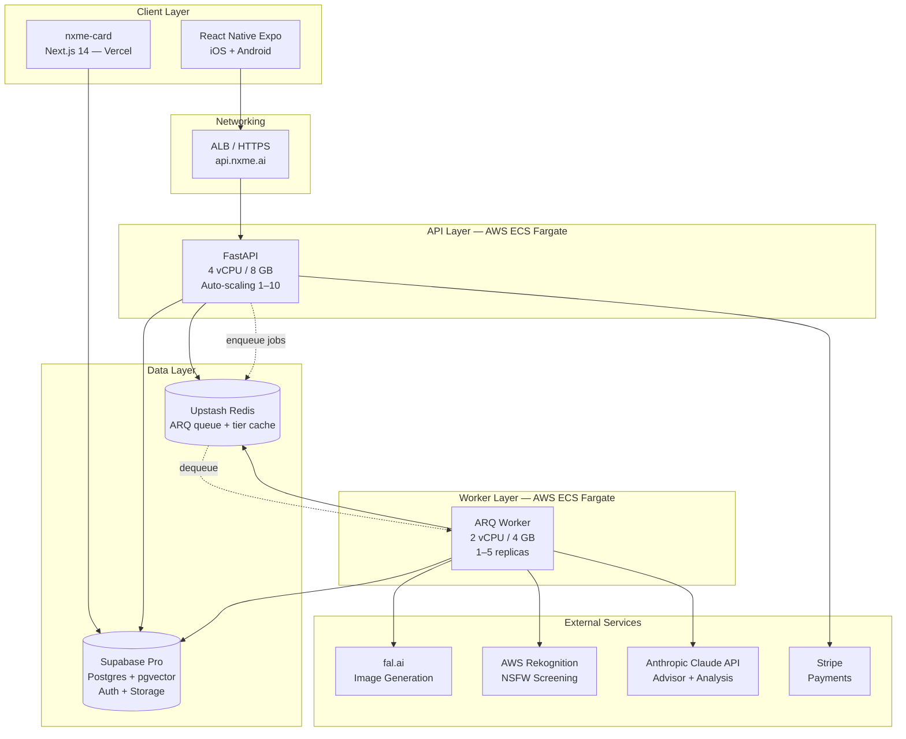

# Architecture: NXME

## 1. Goals & Constraints

### Architecture Drivers (from NFRs)

| Driver | NFR | Architectural Implication |
|--------|-----|--------------------------|
| Face analysis ≤3s P95 | NFR-1 | In-process MediaPipe, pre-loaded at startup (no cold-load latency on scale-out) |
| End-to-end generation ≤30s P95 | NFR-2 | fal.ai serverless GPU; async queue with progress polling |
| Feed load ≤2s P95 | NFR-3 | Paginated cursor API; CDN for all post images |
| Card FCP ≤2s P95 | NFR-4 | Edge-cached SSR (Next.js ISR + on-demand revalidation); no auth on card render path |
| 50k concurrent sessions | NFR-5 | Horizontal scaling on ECS Fargate; Supabase managed DB |
| 10k concurrent generation queue | NFR-6 | ARQ priority queue + backpressure circuit breaker |
| Core API 99.5% uptime | NFR-7 | Multi-AZ ECS; Supabase managed HA; health check endpoints |
| Generation 99.0% uptime | NFR-8 | fal.ai SLA + queue retry; credit release on all failure paths; stuck-job watchdog |
| ≤$0.05 per image | NFR-9 | fal.ai pricing tier; `GlowUpGeneratorPort` for future migration |
| PCI-DSS SAQ-A | NFR-11 | Stripe hosted payment sheet; zero card data on NXME servers |
| ≥80% coverage (analysis + entitlement) | NFR-16 | CI gate; single entitlement module with full test coverage |

### Non-Negotiable Boundaries

- **C-1 LOCKED:** AI modifies only hair, eyebrows, style, lighting — bone structure, nose, jaw, and face shape are immutable at generation prompt level and validated post-generation via identity similarity score.
- **C-2 LOCKED:** No attractiveness score or ranking in any API response, UI element, or data model field.
- **C-3 LOCKED:** Social layer (feed, reactions, comments, shareable cards) carries no authentication or payment gate.
- **DD-5 LOCKED:** Image-to-image diffusion only; text-to-image generation is prohibited.
- **AC-A1:** Reserve-before-enqueue for all credit and trial consumption.
- **AC-D1:** All entitlement checks route through a single `EntitlementService`; no handler reads subscription or credit fields directly.

---

## 2. Component Decomposition

### 2.1 Mobile App — `nxme-mobile` (React Native + Expo)

**Responsibility:** All 31 FRs user-facing interface; camera/gallery upload; generation progress; social feed; payment; auth.

**Key modules:**

| Module | Responsibility |
|--------|---------------|
| `AuthModule` | Supabase Auth SDK (PKCE, social login, Universal/App Links) |
| `EntitlementModule` | Single point for tier checks; reads `GET /entitlement`; never directly reads raw credit or subscription DB fields |
| `UploadModule` | Camera/gallery picker; client-side pre-validation (size ≤20MB, format JPEG/PNG/HEIF) |
| `GenerationModule` | Enqueues job; polls `GET /jobs/{id}`; renders progress UI with elapsed timer and Cancel button |
| `SocialModule` | Feed, reactions, comments; optimistic UI for reactions |
| `PaymentModule` | Stripe Payment Sheet SDK; no card data handled client-side beyond SDK scope |
| `ShareModule` | `nxme.ai/{username}` card URL, Universal/App Links deep link handling |
| `ProfileModule` | Transformation history; profile edit; subscription management |

**Error modeling (TypeScript — per `nodejs.md` convention):**
```ts
type GenerationResult<T> =
  | { ok: true; value: T }
  | { ok: false; error: GenerationError };

type GenerationError = {
  code: 'GENERATION_TIMEOUT' | 'IDENTITY_PRESERVATION_FAILED' | 'PROVIDER_ERROR'
      | 'INSUFFICIENT_CREDITS' | 'CONCURRENT_LIMIT' | 'UNKNOWN';
  message: string;
  credit_refunded: boolean;
  retry_eligible: boolean;
};
```

**Interfaces:** HTTPS REST API; Supabase Auth SDK; Expo Notifications (push); Expo SecureStore (guest session token).

**Dependencies:** API Gateway, Supabase Auth, Stripe React Native SDK.

---

### 2.2 API Gateway — `nxme-api` (Python 3.12 + FastAPI)

**Responsibility:** JWT validation; request routing; rate limiting middleware; response serialization.

**Routers:**

| Router | Endpoints |
|--------|-----------|
| `auth` | POST /register, POST /login, POST /logout, DELETE /account |
| `analyses` | POST /analyses, GET /analyses/{id}, POST /analyses/{id}/generate |
| `jobs` | GET /jobs/{id}, POST /jobs/{id}/cancel |
| `entitlement` | GET /entitlement, POST /credits/purchase, POST /subscriptions, DELETE /subscriptions |
| `social` | GET /feed, POST /posts/{id}/react, POST /posts/{id}/comments, GET /posts/{id}/comments, POST /posts/{id}/report |
| `posts` | POST /posts, DELETE /posts/{id} |
| `users` | GET /users/{username}/profile, GET /users/{username}/history |
| `public` | GET /api/public/cards/{username} (no auth — card data for Next.js SSR) |
| `webhooks` | POST /webhooks/stripe, POST /webhooks/falai |
| `health` | GET /health, GET /readiness |

**Middleware stack (ordered):** TLS termination (ALB) → Rate limiting (Redis token bucket) → JWT auth (Supabase JWKS) → Request validation → Router.

**Interfaces:** HTTP/1.1 + HTTP/2 REST; TLS 1.2+ (terminated at ALB).

**Dependencies:** FaceAnalysisService, EntitlementService, SocialService, GenerationQueueService, ImagePipelineService, StripeAdapter.

---

### 2.3 Face Analysis Service — `face_analysis/`

**Responsibility:** MediaPipe landmark extraction; face shape classification; symmetry scoring; improvement recommendations.

**Model startup:** MediaPipe FaceMesh model is **pre-loaded at container startup** via FastAPI's `lifespan` event handler. The ECS health check (`GET /health`) returns HTTP 200 only after the model load completes. This ensures horizontal scale-out never introduces a cold-load latency spike on the first analysis request to a new task instance.

**Key classes:**

| Class | Responsibility |
|-------|---------------|
| `ImageValidator` | Magic bytes verification (JPEG/PNG/HEIF); dimension check; single-face detection (MediaPipe Face Detection) |
| `LandmarkExtractor` | MediaPipe FaceMesh 468 3D landmarks; **ephemeral — coordinates never persisted** (ADR-1) |
| `FaceShapeClassifier` | Jaw/forehead/cheekbone width ratios → `FaceShape` enum (oval/round/square/heart/oblong) |
| `SymmetryScorer` | Bilateral landmark pair distance variance → float [0.0, 1.0] |
| `RecommendationEngine` | Rule-based: `face_shape × landmark_measurements → List[Suggestion]` (top 5, ranked, no attractiveness language) |

**Latency guarantee:** Full pipeline (validate → extract → classify → score → recommend) runs synchronously in ≤3s on 4-core ECS task with pre-loaded model.

**Interfaces:** Internal Python module; called synchronously from `POST /analyses` handler.

**Dependencies:** `mediapipe` (pre-loaded at startup), `Pillow`, `numpy`.

---

### 2.4 Glow-Up Generation Service — `generation/`

**Responsibility:** Credit reservation coordination; fal.ai generation behind port/adapter; identity preservation check; result delivery.

**Port/Adapter pattern:**

```python
class GlowUpGeneratorPort(Protocol):
    async def generate(
        self,
        source_image_url: str,
        prompt: str,
        options: GenerationOptions,
    ) -> GenerationResult: ...

class FalAiAdapter:
    """Implements GlowUpGeneratorPort via fal.ai image-to-image API."""
    ...
```

**Prompt template (locked — not user-editable):**
```
"same person, {improvement_keywords}, natural portrait, photorealistic,
preserve facial features, preserve bone structure, preserve face shape,
preserve skin tone, soft natural lighting"
```
Where `improvement_keywords` is derived from `Recommendation` objects (e.g., `"refined eyebrow arch, shorter sides haircut"`).

**Identity preservation check (storage-first, in-memory):**
1. fal.ai delivers the generated image URL.
2. The worker **downloads the generated image from the provider into memory** immediately -- the provider URL is never used again after this point.
3. The in-memory bytes are **uploaded to NXME Supabase Storage** (`generated-images` bucket) before any checks run.
4. NSFW screening and ArcFace identity check both operate on **in-memory bytes** (source + generated), not by re-fetching from storage. This avoids an extra round-trip while still ensuring the image is persisted in NXME-controlled storage before any downstream use.
5. `identity_similarity_score` (float 0-1) is computed. If score < `IDENTITY_SIMILARITY_THRESHOLD` (config-backed), the stored image is deleted, the credit is released, and `failure_reason = 'IDENTITY_PRESERVATION_FAILED'`.
6. On identity pass, color normalization runs on the in-memory image and the result **overwrites** the stored file. ArcFace embedding is **never stored** (ADR-1).

**Key classes:**

| Class | Responsibility |
|-------|---------------|
| `GlowUpGeneratorPort` | Protocol/interface for generation adapters |
| `FalAiAdapter` | fal.ai REST API adapter (image-to-image endpoint) |
| `IdentityPreservationChecker` | ArcFace similarity from NXME-controlled storage keys; threshold gate; ephemeral embeddings |
| `CreditReservationCoordinator` | reserve → (commit on delivery) / (release on failure) |

**Interfaces:** `GlowUpGeneratorPort` (adapts to fal.ai); ARQ queue (async worker context); Supabase Storage.

---

### 2.5 Generation Queue — ARQ + Upstash Redis

**Responsibility:** Async priority job processing; per-user concurrency limits (enforced at handler layer — not in worker); cost circuit breaker; timeout/cancellation; stuck-job recovery.

**Queue lanes (three separate ARQ queues for priority):**

| Lane | Priority | User tier |
|------|----------|-----------|
| `generation:premium` | Highest | `PREMIUM` |
| `generation:credit` | Medium | `CREDIT_HOLDER` |
| `generation:trial` | Lowest | `TRIAL` |

**ARQ worker pool configuration:** A single ARQ `Worker` is configured with explicit queue priority ordering:
```python
worker = Worker(
    functions=[process_generation_job],
    queue_read_limit=10,
    queues=['generation:premium', 'generation:credit', 'generation:trial'],
    # ARQ processes queues in order — premium jobs always checked first
)
```
This prevents trial-lane saturation from starving premium jobs without requiring separate worker pools.

**Job lifecycle:**
```
PENDING → QUEUED → PROCESSING → COMPLETED
                              ↘ FAILED → credit_released
                              ↘ CANCELLED → credit_released
```

**Stuck-job watchdog:** A background scheduled task (ARQ `cron_jobs` or ECS Scheduled Task) runs every 60 seconds:
```python
async def watchdog_stuck_jobs(ctx):
    threshold = timedelta(seconds=GENERATION_TIMEOUT_SECONDS + 30)
    stuck_jobs = await db.fetch(
        "SELECT id, credit_reservation_id FROM glow_up_jobs "
        "WHERE status = 'processing' AND updated_at < $1",
        datetime.utcnow() - threshold
    )
    for job in stuck_jobs:
        await transition_to_failed(job.id, 'GENERATION_TIMEOUT')
        await CreditReservationCoordinator.release(job.credit_reservation_id)
```
This ensures worker crashes or stuck jobs never leave credits permanently reserved.

**Circuit breakers (AC-A6):**
- Per-user concurrency: enforced in the **API handler only** (before enqueue), not in the worker. See Section 9.4.
- Cost exposure: rolling 24h cost estimate > `CREDIT_COST_ALERT_USD` average → alert fires; rolling > `IMAGE_GEN_COST_CEILING_USD` → throttle TRIAL lane.
- Queue depth: if estimated wait > `GENERATION_TIMEOUT_SECONDS` → return 503 with queue depth info.

**Interfaces:** ARQ worker functions in Python; Redis via Upstash.

**Dependencies:** FalAiAdapter, CreditReservationCoordinator, Supabase DB.

---

### 2.6 Image Pipeline — `image_pipeline/`

**Responsibility:** Pre-storage safety gate (NSFW); format/dimension validation; EXIF/metadata stripping; sandboxed clean re-encode.

**Processing pipeline (synchronous, every upload before DB write):**

```
Upload received
      ↓
1. MagicBytesValidator   — reject if not JPEG/PNG/HEIF
      ↓
2. DimensionValidator    — reject if > MAX_UPLOAD_SIZE_MB or > MAX_IMAGE_DIMENSION_PX × MAX_IMAGE_DIMENSION_PX
      ↓
3. NSFWScreener          — AWS Rekognition SuggestLabels; reject if explicit content ≥ 80% confidence (≤5s)
      ↓ (if rejected: write images row with status='quarantined', storage_key=NULL; return HTTP 422; halt)
4. MetadataStripper      — Pillow re-encode; strips all EXIF, IPTC, XMP
      ↓
5. ImageEncoder          — Clean PNG/JPEG output, no original byte stream preserved
      ↓
Write to Supabase Storage (raw-selfies bucket, private)
Write images row with status='cleared', storage_key=<bucket key>
```

**NSFW quarantine note:** A quarantined upload writes an `images` row with `status = 'quarantined'` and `storage_key = NULL` (the column is nullable — Section 3.7). No file is written to storage. This satisfies both AC-A3 (never written to storage) and AC-D7 (queryable status field per image). Quarantined rows are excluded from all feed, card, and history endpoints via status filter.

**Sandboxing:** ECS task running image processing has IAM policy with no outbound internet (except to Rekognition endpoint). Pillow processing uses process-level isolation.

**Interfaces:** Internal module; called synchronously from `POST /analyses` upload handler.

**Dependencies:** `Pillow`, `boto3` (Rekognition), Supabase Storage SDK.

---

### 2.7 Entitlement Service — `entitlement/`

**Responsibility:** Single authoritative module for user tier resolution; credit ledger; trial granting; subscription management.

**Canonical tier identifiers (AC-D8):** `TRIAL`, `CREDIT_HOLDER`, `PREMIUM`

These three values are the complete closed set. Used verbatim in: `users.tier` CHECK constraint, API response types, structured log events, and test fixtures. CI grep asserts zero inline string literals for tier values outside the named constants.

**Note on "exhausted trial" state:** A user who has exhausted their free trial and has neither credits nor a subscription is represented as `tier = 'TRIAL'` with `trial_analyses_remaining = 0`. This is NOT a separate tier value — it is a logical state within `TRIAL`. `EntitlementService.can_generate()` returns `False` for this state and the handler returns HTTP 402 with paywall data.

**Entitlement state machine:**

```
TRIAL (trials_remaining > 0)
  → exhaust trials → TRIAL [trials_remaining = 0, can_generate = false]
  → purchase credits → CREDIT_HOLDER
  → subscribe → PREMIUM

CREDIT_HOLDER (credit_balance > 0)
  → exhaust credits → TRIAL [trials_remaining = 0]
  → subscribe → PREMIUM

PREMIUM (active subscription)
  → cancel (access continues until billing_period_end)
  → period ends → CREDIT_HOLDER (if credit_balance > 0) else TRIAL [trials_remaining = 0]
```

**`users.tier` is a derived read cache:** `EntitlementService.get_entitlement(user_id)` always recomputes the canonical entitlement state from `credit_ledger + subscriptions` (never reads `users.tier` directly). `users.tier` is updated as a denormalized performance cache after every entitlement-modifying operation (credit purchase, subscription event, trial grant) in the same transaction. This means:
- `GET /entitlement` always reflects ground truth
- `users.tier` can be used for fast filtering (e.g., queue priority assignment at enqueue time) but must never be the sole source of truth in business logic

**Key classes:**

| Class | Responsibility |
|-------|---------------|
| `EntitlementService` | `get_entitlement(user_id) → EntitlementState`; `can_generate(user_id) → bool + reason` |
| `CreditLedger` | Append-only ledger; balance = `SUM(delta)` per user (see Section 3.5 for invariants); reserve/commit/release |
| `TrialGrantor` | Idempotent: grants `FREE_TRIAL_ANALYSES` credits on first call; email_verified guard; rate-limited per AC-A8 |
| `SubscriptionManager` | Stripe subscription lifecycle → entitlement state sync via webhook |

**Interfaces:** Internal service; exposed via `/entitlement` API routes.

**Dependencies:** Supabase PostgreSQL (credit_ledger, subscriptions tables), StripeAdapter.

---

### 2.8 Social Service — `social/`

**Responsibility:** Feed aggregation; reaction management with guest deduplication; comment CRUD; content reporting.

**Key classes:**

| Class | Responsibility |
|-------|---------------|
| `FeedService` | Cursor-based pagination; sort strategies: `newest` (created_at DESC) / `trending` (HN-style time-decay ranking) / `biggest_improvements` (reaction_count DESC — no AI score input per AC-U10) |
| `ReactionService` | Deduplication via UNIQUE constraints; Redis counter with retry-queue writes; reconciliation job |
| `CommentService` | Authenticated create/delete; public read |
| `ReportService` | Post reports queued for human review |

**`trending` sort — HN-style time-decay ranking:**
```sql
score = reaction_count / POWER(hours_since_post + 2, 1.5)
```
- `hours_since_post = EXTRACT(EPOCH FROM NOW() - created_at) / 3600`
- Gravity exponent `1.5` — lower than HN's `1.8` to keep posts relevant longer (lower volume feed)
- `+ 2` offset prevents division by zero and gives fresh posts a small initial boost
- A 100-reaction post at 1h scores 19.2; at 24h scores 0.75 — natural decay without cliff
- Computed at query time (no background job) — PostgreSQL handles this efficiently with the existing `idx_posts_feed_trending` index as a fallback; for exact score ordering, a sequential scan on the filtered set is acceptable at <100K posts. At scale, add a materialized `trending_score` column updated by a periodic ARQ job.

**`biggest_improvements` sort:** Ordered by `reaction_count DESC`. No AI-computed appearance score, symmetry delta, or any model output is used as an ordering input (AC-U10). Differs from `trending` only in the absence of the time-decay factor — `biggest_improvements` surfaces all-time high-reaction posts while `trending` weights recent engagement.

**Reaction counter strategy (PostgreSQL is canonical):**
- `posts.reaction_count` (DB INT) is the authoritative count for display.
- Redis `posts:{id}:reactions` is a **read-through cache** (TTL: 60s) for low-latency feed display.
- Background async write: `ReactionService` writes the `reactions` DB row via an ARQ background task after the Redis INCR. If the background write fails (e.g., duplicate unique constraint on retry), it is placed in a **retry queue** (up to 3 attempts, not fire-and-forget). On permanent failure, the Redis counter is decremented back.
- **Nightly reconciliation job:** A scheduled ARQ task reconciles `posts.reaction_count` and Redis counters from `COUNT(reactions)` aggregate for all posts with activity in the previous 48 hours. This corrects any accumulated drift.
- On cache miss, `posts.reaction_count` from PostgreSQL is loaded into Redis with a 60s TTL.

**Guest session token:** Durable opaque 32-byte CSPRNG token issued at first app open; stored in Expo SecureStore; 365-day server-side TTL; sent as `X-Guest-Token` header. On account creation, `users.guest_session_token` captures the association for analytics attribution (ADR-2).

**Interfaces:** Internal service; exposed via `/social` and `/posts` API routes.

**Dependencies:** Supabase PostgreSQL, Upstash Redis (reaction counters), ARQ (background write queue).

---

### 2.9 Shareable Card Web App — `nxme-card` (Next.js on Vercel)

**Responsibility:** Server-side rendered `nxme.ai/{username}` card page; no auth required; Open Graph tags; app store CTA.

**Implementation:**
- Next.js 14 App Router with `generateStaticParams` + `revalidate: 60` (ISR, maximum 60s staleness)
- Fetches from `GET /api/public/cards/{username}` (no auth, public FastAPI endpoint)
- Before/after images served from CloudFront (public `generated-images` bucket)
- Open Graph `og:image` generated from before/after composite
- CTA: Universal Link → opens mobile app (or falls back to app store install)

**On-demand revalidation:** When a user deletes their account (FR-5) or deletes a post (FR-25), the FastAPI delete handler calls `revalidatePath('/{username}')` on the Next.js card app via Vercel's `revalidate` API within the same request scope (best-effort; async if latency is a concern). Maximum observable staleness after deletion is ≤60s (ISR fallback). This is documented as a tolerated window; the AC-FR5 72-hour PII deletion SLA applies to storage, not to CDN cache.

**Card deletion:** When the associated post is deleted or the account is removed, `GET /api/public/cards/{username}` returns HTTP 410 Gone. The Next.js page renders an HTTP 410 response (Next.js `notFound()` returns 404; a custom `/api/public/cards` response header `X-Deleted: true` causes the Next.js page to emit 410).

**Interfaces:** Public FastAPI `/api/public/cards/{username}` endpoint; CloudFront CDN; Vercel on-demand revalidation API.

---

### 2.10 Stripe Adapter — `payment/`

**Responsibility:** Credit pack purchase; subscription creation/cancellation; webhook event processing with idempotency.

**PCI-DSS SAQ-A:** All card collection via Stripe Payment Sheet (mobile SDK). NXME never receives, transmits, or stores card data. Webhook signatures verified via `stripe-signature` header.

**Webhook idempotency:** All incoming webhook events are deduplicated by recording `stripe_event_id` in a `processed_webhook_events` table before processing. Duplicate delivery (Stripe retries up to 3 days) returns HTTP 200 immediately without re-processing. Same pattern for fal.ai callbacks.

**Webhook events handled:** `checkout.session.completed`, `customer.subscription.created`, `customer.subscription.deleted`, `customer.subscription.updated`, `invoice.payment_failed`.

**Interfaces:** Stripe SDK; called from `/entitlement` API routes and `/webhooks/stripe` handler.

---

## 3. Data Models

> **Schema source of truth:** The SQL in this section is a conceptual reference model. For exact column names, constraints, and indexes, always refer to the migration files in `app/migrations/`. Migrations may add, rename, or restructure columns beyond what is shown here.

### 3.1 `users`

```sql
CREATE TABLE users (
    id                        UUID PRIMARY KEY DEFAULT gen_random_uuid(),
    username                  TEXT UNIQUE NOT NULL,           -- immutable post-creation (AC-A5)
    display_name              TEXT NOT NULL,
    email                     TEXT UNIQUE,
    avatar_storage_key        TEXT,
    tier                      TEXT NOT NULL DEFAULT 'TRIAL'   -- TRIAL | CREDIT_HOLDER | PREMIUM
                              CHECK (tier IN ('TRIAL', 'CREDIT_HOLDER', 'PREMIUM')),
    -- NOTE: tier is a derived read cache. EntitlementService always recomputes from
    -- credit_ledger + subscriptions. Never use users.tier as the source of truth in business logic.
    trial_analyses_remaining  INT NOT NULL DEFAULT 2,         -- backed by FREE_TRIAL_ANALYSES config
    guest_session_token       TEXT,                           -- pre-registration association (ADR-2)
    email_verified            BOOLEAN NOT NULL DEFAULT FALSE,
    is_minor                  BOOLEAN,                        -- set during registration age gate (AC-U7)
    deleted_at                TIMESTAMPTZ,
    created_at                TIMESTAMPTZ NOT NULL DEFAULT NOW(),
    updated_at                TIMESTAMPTZ NOT NULL DEFAULT NOW()
);
-- RLS: See Section 9.6 for policy definitions
CREATE INDEX idx_users_username ON users (username);
CREATE INDEX idx_users_guest_token ON users (guest_session_token) WHERE guest_session_token IS NOT NULL;
```

### 3.2 `analyses`

```sql
CREATE TABLE analyses (
    id                  UUID PRIMARY KEY DEFAULT gen_random_uuid(),
    user_id             UUID NOT NULL REFERENCES users(id) ON DELETE CASCADE,
    status              TEXT NOT NULL DEFAULT 'pending'
                        CHECK (status IN ('pending', 'processing', 'completed', 'failed')),
    original_image_id   UUID REFERENCES images(id),           -- FK to images table (status must be 'cleared')
    face_shape          TEXT CHECK (face_shape IN ('oval', 'round', 'square', 'heart', 'oblong')),
    symmetry_score      FLOAT CHECK (symmetry_score BETWEEN 0.0 AND 1.0),
    recommendations     JSONB,                      -- List[{rank, category, suggestion_text, rationale}]
    created_at          TIMESTAMPTZ NOT NULL DEFAULT NOW(),
    updated_at          TIMESTAMPTZ NOT NULL DEFAULT NOW()
);
-- NOTE: landmark_vectors are NOT stored — ephemeral per ADR-1
CREATE INDEX idx_analyses_user_id ON analyses (user_id, created_at DESC);
```

### 3.3 `glow_up_jobs`

```sql
CREATE TABLE glow_up_jobs (
    id                          UUID PRIMARY KEY DEFAULT gen_random_uuid(),
    idempotency_key             TEXT UNIQUE NOT NULL,   -- prevents double-enqueue; used as correlation log field
    analysis_id                 UUID NOT NULL REFERENCES analyses(id),
    user_id                     UUID NOT NULL REFERENCES users(id),
    status                      TEXT NOT NULL DEFAULT 'pending'
                                CHECK (status IN ('pending','queued','processing','completed','failed','cancelled')),
    failure_reason              TEXT
                                CHECK (failure_reason IN (
                                    'FACE_VALIDATION_FAILED','GENERATION_TIMEOUT','NSFW_QUARANTINE',
                                    'IDENTITY_PRESERVATION_FAILED','PROVIDER_ERROR','UNKNOWN'
                                ) OR failure_reason IS NULL),
    original_image_id           UUID REFERENCES images(id),   -- FK to images table (the selfie)
    generated_image_id          UUID REFERENCES images(id),   -- FK to images table (the glow-up result)
    identity_similarity_score   FLOAT,
    identity_preserved          BOOLEAN,
    credit_reservation_id       UUID REFERENCES credit_reservations(id),
    user_tier_at_enqueue        TEXT NOT NULL CHECK (user_tier_at_enqueue IN ('TRIAL','CREDIT_HOLDER','PREMIUM')),
    created_at                  TIMESTAMPTZ NOT NULL DEFAULT NOW(),
    updated_at                  TIMESTAMPTZ NOT NULL DEFAULT NOW(),
    completed_at                TIMESTAMPTZ
);
-- NOTE: idempotency_key is emitted as a required structured log field in both nxme-api and nxme-worker
CREATE INDEX idx_jobs_user_id ON glow_up_jobs (user_id, created_at DESC);
CREATE INDEX idx_jobs_status ON glow_up_jobs (status) WHERE status IN ('pending','queued','processing');
CREATE INDEX idx_jobs_watchdog ON glow_up_jobs (updated_at) WHERE status = 'processing';
```

### 3.4 `credit_reservations`

```sql
CREATE TABLE credit_reservations (
    id           UUID PRIMARY KEY DEFAULT gen_random_uuid(),
    user_id      UUID NOT NULL REFERENCES users(id),
    amount       INT NOT NULL DEFAULT 1,
    status       TEXT NOT NULL DEFAULT 'reserved'
                 CHECK (status IN ('reserved', 'committed', 'released')),
    job_id       UUID REFERENCES glow_up_jobs(id),
    created_at   TIMESTAMPTZ NOT NULL DEFAULT NOW(),
    resolved_at  TIMESTAMPTZ
);
CREATE INDEX idx_reservations_user_status ON credit_reservations (user_id, status);
```

### 3.5 `credit_ledger`

```sql
CREATE TABLE credit_ledger (
    id           UUID PRIMARY KEY DEFAULT gen_random_uuid(),
    user_id      UUID NOT NULL REFERENCES users(id),
    delta        INT NOT NULL,           -- positive = credit in, negative = credit out
    type         TEXT NOT NULL
                 CHECK (type IN ('trial_grant','purchase','reserve','commit','release','refund','adjustment')),
    reference_id UUID,                   -- job_id or purchase_id
    note         TEXT,
    created_at   TIMESTAMPTZ NOT NULL DEFAULT NOW()
);
-- BALANCE INVARIANTS (enforced by unit tests in CreditLedger):
--
-- Balance query: SELECT SUM(delta) FROM credit_ledger WHERE user_id = $1
-- This includes ALL types including 'reserve'. Reserve/release pairs net to zero.
-- Reserve/commit pairs net to -1 (the credit is consumed).
--
-- Invariant 1: reserve + release = 0 (net)
--   reserve: delta = -1 (optimistic hold)
--   release: delta = +1 (undo the hold)
--
-- Invariant 2: reserve + commit = -1 (net)
--   reserve: delta = -1
--   commit:  delta = 0 (no second deduction; reserve already reduced balance)
--
-- Invariant 3: No new 'type' value may be added without a corresponding unit test
-- asserting its balance invariant. This is a CI gate.
CREATE INDEX idx_ledger_user_id ON credit_ledger (user_id, created_at DESC);
```

### 3.6 `subscriptions`

```sql
CREATE TABLE subscriptions (
    id                      UUID PRIMARY KEY DEFAULT gen_random_uuid(),
    user_id                 UUID NOT NULL REFERENCES users(id),
    provider                TEXT NOT NULL DEFAULT 'stripe',
    provider_subscription_id TEXT UNIQUE NOT NULL,
    status                  TEXT NOT NULL
                            CHECK (status IN ('active', 'cancelled', 'expired', 'past_due')),
    billing_period_start    TIMESTAMPTZ NOT NULL,
    billing_period_end      TIMESTAMPTZ NOT NULL,
    cancelled_at            TIMESTAMPTZ,
    created_at              TIMESTAMPTZ NOT NULL DEFAULT NOW(),
    updated_at              TIMESTAMPTZ NOT NULL DEFAULT NOW()
);
CREATE INDEX idx_subscriptions_user ON subscriptions (user_id) WHERE status = 'active';
```

### 3.7 `images`

```sql
CREATE TABLE images (
    id             UUID PRIMARY KEY DEFAULT gen_random_uuid(),
    user_id        UUID NOT NULL REFERENCES users(id),
    storage_key    TEXT UNIQUE,                         -- NULLABLE: NULL for quarantined images (never written to storage)
    bucket         TEXT,                                -- 'raw-selfies' (private) | 'generated-images' (public)
    image_type     TEXT NOT NULL
                   CHECK (image_type IN ('selfie','generated_before','generated_after','avatar')),
    status         TEXT NOT NULL DEFAULT 'pending'
                   CHECK (status IN ('pending','cleared','quarantined')),
    screened_at    TIMESTAMPTZ,
    created_at     TIMESTAMPTZ NOT NULL DEFAULT NOW()
);
-- NOTE: Quarantined images have storage_key = NULL (no file was ever written to storage).
-- All feed, card, and history endpoints filter on images.status = 'cleared' (AC-D7).
-- A bulk-quarantine sweep updates images.status and the effect propagates to all
-- public endpoints within one cache TTL without any URL-based reverse-engineering.
CREATE INDEX idx_images_user_status ON images (user_id, status);
CREATE INDEX idx_images_moderation ON images (status) WHERE status IN ('pending', 'quarantined');
```

### 3.8 `posts`

```sql
CREATE TABLE posts (
    id               UUID PRIMARY KEY DEFAULT gen_random_uuid(),
    user_id          UUID NOT NULL REFERENCES users(id),
    glow_up_job_id   UUID NOT NULL REFERENCES glow_up_jobs(id),
    caption          TEXT,
    before_image_id  UUID NOT NULL REFERENCES images(id),   -- FK: enables moderation via join
    after_image_id   UUID NOT NULL REFERENCES images(id),   -- FK: enables moderation via join
    before_image_url TEXT NOT NULL,      -- CloudFront public URL (denormalized for feed query performance)
    after_image_url  TEXT NOT NULL,      -- CloudFront public URL (denormalized for feed query performance)
    reaction_count   INT NOT NULL DEFAULT 0,
    comment_count    INT NOT NULL DEFAULT 0,
    is_deleted       BOOLEAN NOT NULL DEFAULT FALSE,
    created_at       TIMESTAMPTZ NOT NULL DEFAULT NOW(),
    updated_at       TIMESTAMPTZ NOT NULL DEFAULT NOW()
);
-- NOTE: before_image_url / after_image_url are denormalized caches of the CDN URL.
-- Feed queries that need moderation gating must join on images.status = 'cleared'.
-- Moderation sweeps update images.status; the feed join propagates the effect automatically.
CREATE INDEX idx_posts_user ON posts (user_id, created_at DESC) WHERE NOT is_deleted;
CREATE INDEX idx_posts_feed_newest ON posts (created_at DESC) WHERE NOT is_deleted;
CREATE INDEX idx_posts_feed_trending ON posts (reaction_count DESC, created_at DESC) WHERE NOT is_deleted;
```

### 3.9 `reactions`

```sql
CREATE TABLE reactions (
    id                  UUID PRIMARY KEY DEFAULT gen_random_uuid(),
    post_id             UUID NOT NULL REFERENCES posts(id) ON DELETE CASCADE,
    user_id             UUID REFERENCES users(id),            -- NULL for guest reactions
    guest_session_token TEXT,                                 -- NULL for authenticated reactions
    created_at          TIMESTAMPTZ NOT NULL DEFAULT NOW(),
    CONSTRAINT reaction_source_check
        CHECK ((user_id IS NOT NULL) <> (guest_session_token IS NOT NULL)),
    CONSTRAINT reactions_unique_user
        UNIQUE (post_id, user_id),
    CONSTRAINT reactions_unique_guest
        UNIQUE (post_id, guest_session_token)
);
```

### 3.10 `comments`

```sql
CREATE TABLE comments (
    id          UUID PRIMARY KEY DEFAULT gen_random_uuid(),
    post_id     UUID NOT NULL REFERENCES posts(id) ON DELETE CASCADE,
    user_id     UUID NOT NULL REFERENCES users(id),
    content     TEXT NOT NULL CHECK (length(content) BETWEEN 1 AND 1000),
    is_deleted  BOOLEAN NOT NULL DEFAULT FALSE,
    created_at  TIMESTAMPTZ NOT NULL DEFAULT NOW()
);
CREATE INDEX idx_comments_post ON comments (post_id, created_at ASC) WHERE NOT is_deleted;
```

### 3.11 `shareable_cards`

```sql
CREATE TABLE shareable_cards (
    id          UUID PRIMARY KEY DEFAULT gen_random_uuid(),
    user_id     UUID UNIQUE NOT NULL REFERENCES users(id),
    post_id     UUID REFERENCES posts(id),
    slug        TEXT UNIQUE NOT NULL,        -- = username (immutable per AC-A5)
    created_at  TIMESTAMPTZ NOT NULL DEFAULT NOW(),
    updated_at  TIMESTAMPTZ NOT NULL DEFAULT NOW()
);
CREATE INDEX idx_cards_slug ON shareable_cards (slug);
```

### 3.12 `reports`

```sql
CREATE TABLE reports (
    id               UUID PRIMARY KEY DEFAULT gen_random_uuid(),
    post_id          UUID NOT NULL REFERENCES posts(id),
    reporter_user_id UUID NOT NULL REFERENCES users(id),
    reason           TEXT,
    status           TEXT NOT NULL DEFAULT 'pending'
                     CHECK (status IN ('pending','reviewed','actioned','dismissed')),
    created_at       TIMESTAMPTZ NOT NULL DEFAULT NOW()
);
```

### 3.13 `processed_webhook_events` (idempotency table)

```sql
CREATE TABLE processed_webhook_events (
    id           UUID PRIMARY KEY DEFAULT gen_random_uuid(),
    provider     TEXT NOT NULL,          -- 'stripe' | 'falai'
    event_id     TEXT NOT NULL,          -- e.g. Stripe evt_xxx
    processed_at TIMESTAMPTZ NOT NULL DEFAULT NOW(),
    UNIQUE (provider, event_id)
);
```

---

## 4. Key Workflows

### 4.1 Upload → Analyze → Generate → Post (Happy Path)

```
User (mobile)             API              ImagePipeline   FaceAnalysis    EntitlementSvc  GenerationQueue
     │                     │                    │               │                │                │
     ├─POST /analyses ──→  │                    │               │                │                │
     │                     ├─validateImage ──→  │               │                │                │
     │                     │                    ├─magicBytes     │                │                │
     │                     │                    ├─dimensions     │                │                │
     │                     │                    ├─NSFWScreen ─→ AWS Rekognition   │                │
     │                     │                    ├─stripMeta      │                │                │
     │                     │                    ├─writeStorage   │                │                │
     │                     │◄─image cleared ────┤               │                │                │
     │                     ├─analyzeImage ────────────────────→ │                │                │
     │                     │                                     ├─extractLandmarks (ephemeral)   │
     │                     │                                     ├─classifyFaceShape               │
     │                     │                                     ├─scoreSymmetry                  │
     │                     │                                     ├─generateRecommendations        │
     │◄─analysis_id ──────  │◄──── analysis result ─────────────┤                │                │
     │                     │                                                      │                │
     ├─POST /analyses/{id}/generate ──────────────────────────→  │                │                │
     │                     │                                      ├─canGenerate? ─┤                │
     │                     │                                      │◄─ TRIAL (2 remaining)          │
     │                     │              ┌──── SELECT FOR UPDATE on user row ────┤                │
     │                     │              │     in-flight count ≤ MAX_CONCURRENT? │                │
     │                     │              └─────────────────────────────────────→ │                │
     │                     │                                      ├─reserveCredit ─────────────→  │
     │                     │                                      │◄─ reservation_id               │
     │                     │                                      ├─enqueueJob ───────────────────→│
     │◄─202 {job_id} ──── │                                                                        │
     │                                                                                              │
     ├─GET /jobs/{id} ─→ 200 {status: queued, estimated_wait: 15s}                                 │
     │                                                                                              │
     │                            (ARQ worker picks up job from priority lane)                     │
     │                                              ├─generateImage (fal.ai)                       │
     │                                              │◄─ generated image URL                         │
     │                                              ├─writeGeneratedImages (NXME Supabase Storage)  │
     │                                              ├─checkIdentityPreservation (from Storage keys)│
     │                                              ├─commitCredit                                 │
     │                                              ├─updateJob (status: completed) + emit job_id  │
     │                                                                                              │
     ├─GET /jobs/{id} ─→ 200 {status: completed, before_url, after_url}                            │
     ├─POST /posts ─→ 201 {post_id}
```

### 4.2 Credit Failure Path (Reserve-Before-Enqueue)

```
On any failure after reservation:
  generateImage fails (timeout | provider_error)
    → job.status = FAILED
    → job.failure_reason = GENERATION_TIMEOUT | PROVIDER_ERROR
    → CreditReservationCoordinator.release(reservation_id)
    → credit_reservations.status = 'released'
    → credit_ledger entry: type='release', delta=+1

On identity preservation failure:
    → job.failure_reason = IDENTITY_PRESERVATION_FAILED
    → same release path above

On cancel (user taps Cancel before completion):
    → POST /jobs/{id}/cancel
    → job.status = CANCELLED
    → same release path above

On worker crash (stuck-job watchdog):
    → watchdog detects status='processing' AND updated_at < threshold
    → transitions to FAILED, failure_reason = 'GENERATION_TIMEOUT'
    → same release path above

Guarantee: no credit is permanently consumed unless job.status = 'completed' AND result delivered to user.
```

### 4.3 Guest React → Register → Continue (Viral Acquisition Flow)

```
Guest opens nxme.ai/{username} shared card
  → GET /api/public/cards/{username} (no auth) → card data
  → Card web app renders before/after + suggestions + CTA button

Guest taps CTA in mobile app:
  → App opens (Universal Link / deep link)
  → AuthModule: signup flow begins
  → guest_session_token from SecureStore passed to POST /register
  → users.guest_session_token = token (for attribution analytics per ADR-2)
  → TrialGrantor.grant(user_id) → trial_analyses_remaining = FREE_TRIAL_ANALYSES
  → Navigate to contextual onboarding: shows trial count + upload prompt (AC-U6)

Guest reacts to feed post (no account):
  → POST /posts/{id}/react with X-Guest-Token header
  → ReactionService deduplicates: UNIQUE (post_id, guest_session_token)
  → Redis INCR posts:{id}:reactions (optimistic display)
  → Background ARQ task: write reactions row to DB (retry queue, not fire-and-forget)
```

### 4.4 NSFW Screening Rejection

```
User uploads selfie
  → ImagePipeline.NSFWScreener calls AWS Rekognition
  → Rekognition returns {ModerationLabels: [{Name: "Explicit Nudity", Confidence: 91.2}]}
  → Confidence ≥ 80% threshold
  → Write images row: {status: 'quarantined', storage_key: NULL}  ← storage_key is nullable
  → Storage write is BLOCKED (file never written to raw-selfies bucket per AC-A3)
  → POST /analyses returns HTTP 422 {code: "IMAGE_QUARANTINED", ...}
  → No credit or trial consumed
  → Quarantined row queryable via images.status for audit/moderation sweep (AC-D7)
```

### 4.5 Subscription Lifecycle via Stripe Webhook

```
User subscribes:
  POST /subscriptions → create Stripe checkout session → 302 to Stripe Payment Sheet
  User completes payment in Stripe UI
  Stripe → POST /webhooks/stripe {type: "checkout.session.completed", id: "evt_xxx"}
  StripeAdapter: INSERT processed_webhook_events(provider='stripe', event_id='evt_xxx')
                 (UNIQUE constraint prevents duplicate processing)
  StripeAdapter: INSERT subscriptions row (status: active, billing_period_*)
  EntitlementService: recompute tier from ledger+subscriptions → users.tier = 'PREMIUM' (cache update)

User cancels:
  DELETE /subscriptions → Stripe cancel_at_period_end
  Stripe → POST /webhooks/stripe {type: "customer.subscription.updated", cancel_at_period_end: true}
  subscriptions.cancelled_at = NOW()
  (access continues until billing_period_end — AC-FR4)

Period ends:
  Stripe → POST /webhooks/stripe {type: "customer.subscription.deleted"}
  subscriptions.status = 'expired'
  EntitlementService: recompute → if credit_balance > 0 → users.tier = 'CREDIT_HOLDER'
                                  else → users.tier = 'TRIAL'
```

---

## 5. Error Handling Strategy

### Error Taxonomy

| Code | HTTP | Description | Credit Impact |
|------|------|-------------|--------------|
| `FACE_NOT_DETECTED` | 422 | No face found in image | None |
| `MULTIPLE_FACES` | 422 | More than one face detected | None |
| `FACE_OBSTRUCTED` | 422 | Face partially covered | None |
| `IMAGE_TOO_BLURRY` | 422 | Blur threshold exceeded | None |
| `IMAGE_FORMAT_REJECTED` | 422 | Magic bytes not JPEG/PNG/HEIF | None |
| `IMAGE_TOO_LARGE` | 422 | File exceeds MAX_UPLOAD_SIZE_MB or dimensions | None |
| `IMAGE_QUARANTINED` | 422 | NSFW screening rejected | None |
| `INSUFFICIENT_CREDITS` | 402 | No trial, credits, or subscription | None |
| `CONCURRENT_LIMIT` | 409 | MAX_CONCURRENT_GENERATIONS_PER_USER reached | None |
| `GENERATION_TIMEOUT` | 504 | Job exceeded GENERATION_TIMEOUT_SECONDS | Released |
| `IDENTITY_PRESERVATION_FAILED` | 422 | ArcFace similarity below threshold | Released |
| `PROVIDER_ERROR` | 502 | fal.ai API error or storage fetch failure | Released |
| `UNKNOWN` | 500 | Unhandled exception | Released + alert |

### Error Response Format

```json
{
  "error": {
    "code": "GENERATION_TIMEOUT",
    "message": "Generation did not complete in time. Your credit has been refunded.",
    "retry_eligible": true,
    "job_id": "uuid-of-failed-job"
  }
}
```

### Structured Log Contract

Every generation-related log event (both `nxme-api` and `nxme-worker`) MUST include `job_id` (= `glow_up_jobs.idempotency_key`) as a top-level structured field. This enables cross-boundary trace reconstruction via CloudWatch Logs Insights:

```
fields @timestamp, @message
| filter job_id = "specific-job-id"
| sort @timestamp asc
```

### Recovery Patterns

**Queue failures:** ARQ retries with exponential backoff (3 attempts: 5s, 30s, 120s). After 3 failures → `FAILED` + credit released.

**Worker crash:** Watchdog process (Section 2.5) transitions stuck `PROCESSING` jobs to `FAILED` after `GENERATION_TIMEOUT_SECONDS + 30s`. Credit is released.

**fal.ai provider errors:** `FalAiAdapter` retries idempotently using fal.ai's idempotency key (= `glow_up_jobs.idempotency_key`). Max 2 retries before propagating `PROVIDER_ERROR`.

**Webhook failures:** Deduplicated via `processed_webhook_events`. Acknowledged HTTP 200 immediately; processing is async. Idempotency enforced by UNIQUE constraint on `(provider, event_id)`.

**UNKNOWN exceptions:** Set `failure_reason = 'UNKNOWN'`, trigger CloudWatch alarm, release the credit.

**Credit double-commit prevention:** `glow_up_jobs.idempotency_key` UNIQUE constraint. `committed` → `committed` is a no-op; attempting `commit` after `released` is rejected at the service layer.

---

## 6. Design Rationale (DD-* Log)

### DD-1: App Name and Domain
- **Status:** LOCKED
- **Decision:** App name = NXME, domain = `nxme.ai`, meaning "Next Me"
- **Rationale:** Domain acquired; brand positioning as "see your next self" established.

### DD-2: Social-First Architecture
- **Status:** LOCKED
- **Decision:** Every analysis result is a shareable post; social feed ships with MVP.
- **Rationale:** Adding social to an analysis tool later rarely works; viral K-factor requires social from day one.

### DD-3: No Attractiveness Rating
- **Status:** LOCKED
- **Decision:** No attractiveness score, no user ranking by appearance.
- **Alternatives considered:** Looksmax-style numerical rating (rejected — brand risk, regulatory exposure, community toxicity).
- **Rationale:** Brand positioning as "visual guide to improvement"; regulatory and trust risk of beauty scoring.

### DD-4: Credits + Subscription Monetization
- **Status:** LOCKED
- **Decision:** Social layer fully free; 1–2 trial analyses; credit packs; subscription $5–10/month unlimited.
- **Alternatives considered:** Subscription-only (too high barrier for one-time buyers); ad-supported (destroys UX; privacy concerns with facial data).
- **Rationale:** Credits lower purchase commitment; subscription maximizes LTV; free social layer maximizes viral acquisition.

### DD-5: Image-to-Image Diffusion
- **Status:** LOCKED
- **Decision:** Image-to-image diffusion (not text-to-image from scratch) for identity preservation.
- **Rationale:** Text-to-image generates a different person. Image-to-image with ControlNet preserves facial structure.

### DD-6: React Native + Expo (TypeScript)
- **Status:** LOCKED
- **Alternatives considered:** Native iOS/Android (2× codebase), Flutter (Dart learning curve), React Native bare (more boilerplate).
- **Rationale:** Single codebase; TypeScript throughout; Expo Camera/ImagePicker/SecureStore/Notifications cover all MVP requirements.

### DD-7: fal.ai for AI Generation (behind GlowUpGeneratorPort)
- **Status:** LOCKED
- **Alternatives considered:** Replicate (slower cold starts), Modal (self-managed containers, better at >50k/day), self-hosted GPU (>$10k/month premature at MVP).
- **Rationale:** fal.ai: $0.015–0.035/image; 8–20s latency; ControlNet + SDXL support. `GlowUpGeneratorPort` enables future migration without API changes.

### DD-8: Python + FastAPI / Supabase / AWS ECS / ARQ + Upstash Redis / AWS Rekognition
- **Status:** LOCKED
- **Backend:** Python + FastAPI — native MediaPipe integration; FastAPI async model aligns with ARQ.
- **Database + Auth + Storage:** Supabase — consolidates RDS + Cognito + S3; Postgres-compatible; Auth handles PKCE natively.
- **Compute:** AWS ECS Fargate — no cluster management; integrates with ALB, CloudFront, Rekognition.
- **Queue:** ARQ + Upstash Redis — Python-native async queue designed for FastAPI's asyncio model. (Original research referenced BullMQ as a Node.js-only reference; ARQ provides equivalent Redis-backed priority queue semantics in Python.)
- **CDN:** AWS CloudFront — serves generated public images globally.
- **NSFW Screening:** AWS Rekognition — synchronous, $0.001/image, ≤3s typical.

### DD-9: Supabase Auth
- **Status:** LOCKED
- **Alternatives considered:** Clerk (higher cost at scale), Firebase Auth (Google lock-in), Auth0 (enterprise-focused).
- **Rationale:** Included in Supabase stack; native PKCE; Apple/Google OAuth built-in; React Native SDK.

### DD-10: AWS Rekognition for NSFW Screening
- **Status:** LOCKED (automated screening at launch)
- **Full moderation policy:** DEFERRED post-launch.
- **Rationale:** Co-located with ECS; synchronous ≤5s; $0.001/image; fits pre-storage gate pattern.

---

### ADR-1: Biometric Data Lifecycle (AC-A4 resolution)

**Date:** 2026-03-15
**Decision:** Facial landmark vectors and identity embeddings are **ephemeral** — computed in-request, never persisted.

**Details:**
- MediaPipe 468 landmark coordinates: computed during analysis, used to derive `face_shape` (enum) and `symmetry_score` (float). Only derived values stored. Coordinates discarded after handler returns.
- ArcFace identity embedding: computed post-generation to calculate `identity_similarity_score`. Score and `identity_preserved` boolean stored. Embedding vector discarded immediately after comparison.

**Rationale:** Eliminates biometric data retention obligations under GDPR Art. 9, CCPA, and BIPA. Derived values (face shape, symmetry score, similarity score) are not reversible to the original face.

**Risk:** Future features requiring persistent landmark data (Glow-Up Timeline, progress tracking) require a new ADR covering legal basis per jurisdiction, encryption specification, and explicit user consent before implementation.

---

### ADR-2: Guest Reaction Attribution — OQ-1 Resolution (AC-D3 requirement)

**Date:** 2026-03-15
**Decision:** Guest reactions are **ephemeral for attribution** — durable only for deduplication. Not retroactively attributed to a user account created later.

**Details:**
- Reactions table: `UNIQUE (post_id, guest_session_token)` for deduplication.
- On account creation: `users.guest_session_token` captures the association for analytics only.
- API: authenticated user reactions use `user_id`; guest reactions use `guest_session_token`. Never merged.

**Rationale:** Retroactive attribution requires schema migration, adds complexity, creates duplicate reaction risk, and raises pre-registration tracking concerns. Deduplication (the primary goal) is achieved by the unique constraint.

---

## 7. Testing Strategy

### Framework and Patterns

| Layer | Framework | Pattern |
|-------|-----------|---------|
| Python backend unit tests | `pytest` + `pytest-asyncio` | AAA (Arrange-Act-Assert); table-driven for rule-based logic |
| Python integration tests | `pytest` + `httpx` (ASGI test client) | Real Supabase dev instance; real Redis (Upstash test env) |
| React Native unit tests | Jest + React Native Testing Library | Component render tests; hook tests; discriminated union error assertions |
| React Native E2E | Detox (iOS) / Maestro (Android) | Full user flow tests |
| Load tests | Locust (Python) | Validates NFR-1, NFR-2, NFR-3 targets; includes scale-out scenario for NFR-1 |

### Integration Test Isolation

All integration tests use a real Supabase dev instance. Isolation strategy:
- Per-test unique identifier prefix: all created resources (usernames, emails, storage keys) are prefixed with a test-run UUID to prevent cross-test contamination.
- `pytest` fixtures use `yield` + `DELETE FROM` teardown in reverse dependency order (reactions → comments → posts → jobs → analyses → users).
- Reserved-word username tests (AC-A5) use a controlled non-conflicting prefix (e.g., `test_feed_reserved`).
- CI runs integration tests with `pytest-xdist` workers each assigned a non-overlapping user ID range.

### Coverage Requirements (NFR-16 CI gate)

- **Face analysis pipeline** (`face_analysis/` module): ≥80% line coverage — CI gate
- **Entitlement service** (`entitlement/` module): ≥80% line coverage — CI gate
- **Credit reservation paths**: 100% branch coverage of all rollback paths (AC-D2) — CI gate

### Credit Ledger Invariant Tests (required — Section 3.5)

```python
def test_reserve_release_nets_zero(db):
    user = create_test_user(trial_balance=2)
    reservation = CreditLedger.reserve(user.id, amount=1)
    CreditLedger.release(reservation.id)
    assert CreditLedger.balance(user.id) == 2   # unchanged

def test_reserve_commit_nets_minus_one(db):
    user = create_test_user(trial_balance=2)
    reservation = CreditLedger.reserve(user.id, amount=1)
    CreditLedger.commit(reservation.id)
    assert CreditLedger.balance(user.id) == 1   # one credit consumed
```

### Key Test Cases

**Entitlement module:**
- Trial grant: fresh account has `FREE_TRIAL_ANALYSES` balance (AC-FR1)
- Trial exhaustion → paywall (AC-U2)
- Credit reserve/commit/release at each failure injection point (AC-A1)
- Subscription cancel: Premium access until `billing_period_end + 1s` (AC-FR4)
- Concurrent generation limit: two simultaneous requests → exactly one 202 + one 409 (AC-A11)

**Face analysis pipeline:**
- Each face shape classification (5 cases) with synthetic landmark data from `tests/fixtures/face_data.py`
- Symmetry score range [0.0, 1.0] assertion
- Face validation rejection: multiple faces, obstructed, blurry (AC-U4)
- MediaPipe pre-load: health check returns 200 only after model loaded

**NSFW screening:**
- Flagged image: zero objects written to storage; `images.status = 'quarantined'` with `storage_key = NULL` (AC-A3)
- Cleared image: written successfully; `images.status = 'cleared'` with storage key
- Timing: ≤5s for rejection

**Stuck-job watchdog:**
- Inject: set job `status = 'processing'` with `updated_at` beyond threshold; trigger watchdog
- Assert: job transitions to `FAILED`, credit released (Section 2.5 watchdog)

**Identity preservation:**
- ArcFace fetch failure: asserts `failure_reason = 'PROVIDER_ERROR'` and credit released
- Below-threshold: asserts result blocked and credit released
- Source image fetched from NXME Storage (not fal.ai URL)

**Social:**
- Guest reaction deduplication (AC-U9)
- `biggest_improvements` sort: assert no appearance-model output field in sort query
- Feed: quarantined/pending images absent via `images.status = 'cleared'` join (AC-D7)

### Test Data Strategy

- Synthetic face landmark data from `tests/fixtures/face_data.py` — no real user photos in CI
- NSFW: Rekognition mock responses for CI; real Rekognition in staging
- Stripe: test mode webhooks for all payment flows
- fal.ai: `MockGlowUpAdapter` for unit/integration tests; real fal.ai in staging

### Mocking Philosophy

- **No mock databases** — all integration tests hit real Supabase dev instance
- **Mock at port boundaries** — `GlowUpGeneratorPort`, `NSFWScreener`, `StripeAdapter` mocked in unit tests
- **Real Redis** in integration tests (Upstash test environment)

---

## 8. API Contracts

### Authentication

**POST /auth/register**
```json
// Request
{
  "email": "user@example.com",
  "password": "...",
  "username": "alexk",
  "display_name": "Alex K",
  "guest_session_token": "abc123",   // optional
  "birth_year": 2000                 // for age gate (AC-U7)
}
// Response 201
{
  "user_id": "uuid",
  "username": "alexk",
  "tier": "TRIAL",
  "trial_analyses_remaining": 2,
  "access_token": "supabase-jwt"
}
// Response 422
{ "error": { "code": "USERNAME_RESERVED", "message": "This username is reserved." } }
```

**POST /auth/logout**
```json
// Response 204 (session invalidated server-side within ≤1s — AC-FR9)
```

### Face Analysis

**POST /analyses** (multipart/form-data: `file`)
```json
// Response 201
{
  "analysis_id": "uuid",
  "face_shape": "oval",
  "symmetry_score": 0.82,
  "recommendations": [
    { "rank": 1, "category": "eyebrows", "suggestion": "Arch your brows slightly higher to elongate your face" },
    { "rank": 2, "category": "hair", "suggestion": "Try layers that add volume at the crown" }
  ],
  "status": "completed"
}
// Response 422
{ "error": { "code": "FACE_NOT_DETECTED", "message": "No face was detected. Please upload a clear, front-facing selfie.", "retry_eligible": true } }
```

**POST /analyses/{analysis_id}/generate**
```json
// Request
{ "idempotency_key": "client-generated-uuid" }
// Response 202
{ "job_id": "uuid", "status": "queued", "estimated_wait_seconds": 15, "queue_position": 3 }
// Response 402
{ "error": { "code": "INSUFFICIENT_CREDITS", "message": "You have no remaining analyses.", "paywall": true } }
// Response 409
{ "error": { "code": "CONCURRENT_LIMIT", "message": "You already have 3 generations in progress." } }
```

**GET /jobs/{job_id}**
```json
// In progress
{ "job_id": "uuid", "status": "processing", "elapsed_seconds": 8, "estimated_wait_seconds": 12 }
// Completed
{
  "job_id": "uuid",
  "status": "completed",
  "before_image_url": "https://cdn.nxme.ai/generated/uuid-before.jpg",
  "after_image_url": "https://cdn.nxme.ai/generated/uuid-after.jpg",
  "identity_preserved": true
}
// Failed
{ "job_id": "uuid", "status": "failed", "failure_reason": "GENERATION_TIMEOUT", "credit_refunded": true, "retry_eligible": true }
```

### Entitlement

**GET /entitlement**
```json
// CREDIT_HOLDER
{ "tier": "CREDIT_HOLDER", "credit_balance": 4, "trial_analyses_remaining": 0, "subscription": null }
// PREMIUM
{ "tier": "PREMIUM", "credit_balance": 0, "trial_analyses_remaining": 0,
  "subscription": { "status": "active", "billing_period_end": "2026-04-15T00:00:00Z", "cancel_at_period_end": false } }
// TRIAL (exhausted)
{ "tier": "TRIAL", "credit_balance": 0, "trial_analyses_remaining": 0, "subscription": null }
```

### Social Feed

**GET /feed?sort={newest|trending|biggest_improvements}&cursor={cursor}&limit=20**

Sort strategies:
- `newest` — `ORDER BY created_at DESC`
- `trending` — `ORDER BY (reaction_count / POWER(hours_since + 2, 1.5)) DESC`
- `biggest_improvements` — `ORDER BY reaction_count DESC`
```json
{
  "posts": [
    {
      "post_id": "uuid",
      "user": { "username": "alexk", "display_name": "Alex K", "avatar_url": "..." },
      "before_image_url": "https://cdn.nxme.ai/...",
      "after_image_url": "https://cdn.nxme.ai/...",
      "caption": "My first glow-up!",
      "reaction_count": 142,
      "comment_count": 7,
      "created_at": "2026-03-15T12:00:00Z"
    }
  ],
  "next_cursor": "base64-cursor",
  "has_more": true
}
```

### Shareable Card (Public — no auth)

**GET /api/public/cards/{username}**
```json
// 200
{
  "username": "alexk",
  "display_name": "Alex K",
  "before_image_url": "https://cdn.nxme.ai/...",
  "after_image_url": "https://cdn.nxme.ai/...",
  "recommendations": [ "..." ],
  "post_id": "uuid",
  "app_store_url": "...",
  "play_store_url": "..."
}
// 410 (deleted)
{ "error": { "code": "CARD_GONE", "message": "This card is no longer available." } }
```

---

## 9. Security

**Depth: HIGH** — handles PII, financial transactions (PCI-DSS), biometric-derived data, user-generated image content.

### 9.1 Authentication & Session Management

- Supabase Auth issues Supabase-signed JWTs (RS256). FastAPI validates via JWKS endpoint.
- **Social login:** Authorization Code + PKCE (RFC 7636). Implicit flow rejected. Redirect URIs: Universal Links (iOS) / App Links (Android) only — custom URI schemes rejected (AC-A9).
- `id_token` validation: `iss`, `aud`, `exp`, `nonce` validated on every authentication.
- Session invalidation: revocation propagates within ≤1s (AC-FR9).
- Guest session token: 32-byte CSPRNG; Expo SecureStore; never in URLs; 365-day server-side TTL.

### 9.2 Free Trial Farming Prevention (AC-A8)

- **Device fingerprint rate limit:** ≤`MAX_FREE_ACCOUNTS_PER_DEVICE` per 24h.
- **IP rate limit:** ≤`MAX_FREE_ACCOUNTS_PER_IP_PER_HOUR` per hour.
- **Email verification required** before `TrialGrantor` grants free credits.
- **Disposable email rejection:** Known domain blocklist at registration. Credits withheld until real email confirmed.

### 9.3 Image Upload Security (AC-A10)

- Magic bytes validation before processing.
- Dimension + size check before full decode (image bomb prevention).
- Pillow clean re-encode — original byte stream discarded (polyglot file prevention).
- Processing in ECS task with no outbound internet (except Rekognition).
- EXIF/IPTC/XMP stripped from all stored images (AC-FR3, AC-NFR10).

### 9.4 Credit Race Condition Prevention (AC-A1, AC-A11)

**Concurrency gate (handler-only, not worker):** The per-user concurrent generation check is enforced **exclusively in the API handler** using a `SELECT FOR UPDATE` on the user's row before enqueue. The ARQ worker does NOT duplicate this check. Logic:

```python
async def generate(analysis_id: UUID, user_id: UUID, ...):
    async with db.transaction():
        # Lock user row to prevent concurrent enqueue
        user = await db.fetchrow(
            "SELECT id FROM users WHERE id = $1 FOR UPDATE", user_id
        )
        in_flight = await db.fetchval(
            "SELECT COUNT(*) FROM glow_up_jobs "
            "WHERE user_id = $1 AND status IN ('queued','processing')", user_id
        )
        if in_flight >= MAX_CONCURRENT_GENERATIONS_PER_USER:
            raise ConcurrentLimitError()
        reservation = await CreditReservationCoordinator.reserve(user_id)
        job = await enqueue_job(analysis_id, user_id, reservation.id)
    return job
```

**Reserve-before-enqueue:** Credit reserved before job enqueue. Status transitions idempotent.

### 9.5 Age Gate and Minor Protection (AC-U7)

- `birth_year` collected at registration; `users.is_minor` set based on jurisdiction.
- Minor-flagged users cannot access the face analysis pipeline (`EntitlementService.can_generate()` returns False for `is_minor = true` without completed consent).
- Consent model: a `user_consents` table records explicit parental/guardian consent with timestamp before minor access is granted. Full design in a jurisdiction-specific ADR before implementation.

### 9.6 Row-Level Security (RLS) Policies

All 12 core tables have RLS enabled with explicit policies. Summary:

| Table | Public Read | Authenticated Read | Write Rule |
|-------|------------|-------------------|------------|
| `users` | No | Own row only | Own row only |
| `analyses` | No | Own rows only | Own user_id only |
| `glow_up_jobs` | No | Own rows only | Own user_id only |
| `credit_reservations` | No | Own rows only | Service role only |
| `credit_ledger` | No | Own rows only | Service role only |
| `subscriptions` | No | Own rows only | Service role only |
| `images` | No | Own rows only | Service role only |
| `posts` | Yes (not deleted, images cleared) | All | Own user_id only |
| `reactions` | No (count served via API) | Via API | Via API (guest or auth) |
| `comments` | Yes (not deleted) | All | Own user_id only |
| `shareable_cards` | Yes (via slug lookup) | All | Own user_id only |
| `reports` | No | Own rows only | Own user_id only |

**Supabase PostgREST bypass prevention:** All four private financial tables (`analyses`, `glow_up_jobs`, `credit_reservations`, `credit_ledger`) have RLS FORCE enabled — they reject cross-user reads even when accessed via Supabase's PostgREST REST API surface with a valid user JWT.

### 9.7 OWASP Top 10 Analysis

| Risk | Mitigation |
|------|-----------|
| A01 Broken Access Control | RLS on all tables (Section 9.6); JWT user_id validation in every handler |
| A02 Cryptographic Failures | TLS 1.2+ (ALB enforced); AES-256 storage (Supabase managed); no raw card data; EXIF stripped |
| A03 Injection | FastAPI Pydantic validation; Supabase parameterized queries; no raw SQL interpolation |
| A04 Insecure Design | Reserve-before-enqueue; NSFW pre-storage gate; identity preservation check; stuck-job watchdog |
| A05 Security Misconfiguration | ECS least-privilege IAM; Supabase bucket policies (raw-selfies: private; generated-images: public read); no admin credentials in app |
| A06 Vulnerable Components | `pip-audit` + `npm audit` in CI; Dependabot |
| A07 Auth Failures | PKCE required; custom URI rejection; email verification before credit grant; session invalidation ≤1s |
| A08 Software/Data Integrity | Stripe webhook signature + event deduplication; fal.ai callback HMAC; idempotency keys on all writes |
| A09 Security Logging | Structured logs for auth, credit state changes, NSFW rejections, identity failures; CloudWatch alarm on UNKNOWN failures; `job_id` in all generation logs |
| A10 SSRF | Image processing ECS has no outbound internet; fal.ai calls from generation worker only |

### 9.8 PCI-DSS SAQ-A Compliance

- All card collection via Stripe Payment Sheet (mobile SDK). No PAN/CVV/expiry on NXME.
- Stripe webhook payload: no card fields.
- SAQ-A self-assessment completed before payment feature ships.

### 9.9 Data Privacy

- PII: email, display_name encrypted at rest (Supabase managed AES-256).
- Selfie images: private bucket; signed URL ≤1h expiry (AC-NFR10).
- Biometric data: ephemeral per ADR-1.
- Account deletion: AC-FR5 (primary storage 72h, CDN 7 days, backups 30 days; card URL → HTTP 410; username reserved 180 days).

---

## 10. Infrastructure & Deployment

### Environments

| Environment | Purpose | Supabase | ECS | fal.ai |
|-------------|---------|----------|-----|--------|
| `dev` | Local development | Supabase CLI (local) | Docker Compose | MockGlowUpAdapter |
| `staging` | Integration testing | Supabase staging project | ECS single-task | fal.ai test mode |
| `production` | Live traffic | Supabase production project | ECS multi-AZ | fal.ai production |

### Production Architecture

```
Mobile App (RN + Expo)                    Card Web App (Next.js / Vercel)
       │                                           │
       ↓ HTTPS                                     ↓ HTTPS
  AWS ALB (HTTPS termination, TLS 1.2+)        Vercel Edge Network (global)
       │
       ↓
  AWS ECS Fargate (nxme-api)          AWS ECS Fargate (nxme-worker)
  [FastAPI — API handlers]            [ARQ workers — generation jobs]
  ML: mediapipe (face analysis)       ML: arcface (identity check only)
       │                                     │
       ├─── Supabase PostgreSQL ◄────────────┤  (shared DB)
       ├─── Supabase Auth
       ├─── Supabase Storage ────────────────┤
       │         ├─ raw-selfies (private)    │
       │         └─ generated-images ──────────── AWS CloudFront (CDN, public read)
       ├─── Upstash Redis (ARQ queue) ◄──────┤
       ├─── AWS Rekognition ─────────────────┘
       └─── fal.ai API ◄─────────────────── (nxme-worker only)
                                     │
                                  Stripe API
```

### ECS Service Configuration

**`nxme-api` (FastAPI):**
- Task: 1 vCPU, 2GB RAM — MediaPipe FaceMesh model pre-loaded at startup (~500MB RAM)
- Startup probe: `GET /health` returns HTTP 200 only after MediaPipe model load completes
- Auto-scaling: 2–20 tasks; scale on CPU >60% or ALB request count
- Multi-AZ: 2 availability zones

**`nxme-worker` (ARQ workers):**
- Task: 2 vCPU, 4GB RAM — ArcFace model loaded at startup for identity preservation checks (~2.5GB RAM for model + concurrent job headroom)
- ML inventory: ArcFace only (MediaPipe runs in `nxme-api`, NOT here)
- Startup probe: ArcFace model loaded before worker begins polling queues
- Auto-scaling: 1–10 tasks; scale on ARQ queue depth

### CI/CD (detailed in `/devops` Pass 1)

- GitHub Actions: lint → test → build Docker → push ECR → deploy ECS
- EAS Build for React Native (Expo Application Services)
- EAS Update for OTA JS updates

### Monitoring

- CloudWatch: ECS task metrics (CPU, memory, request count), ALB 5xx rate, ARQ queue depth
- Structured logs (JSON): all API requests, credit state transitions, generation outcomes — all with `job_id`
- Cost alert: CloudWatch alarm when rolling 24h average cost/image > `CREDIT_COST_ALERT_USD`
- Uptime: synthetic monitoring on `/health`, feed endpoint, card endpoint from 3 regions
- Watchdog alarm: CloudWatch alarm if watchdog releases >5 credits/hour (indicates systemic worker instability)

---

## 11. UI Component Architecture

### Navigation Structure (React Navigation)

```
RootNavigator
├── AuthStack (unauthenticated)
│   ├── WelcomeScreen
│   ├── SignUpScreen (includes age gate — AC-U7)
│   └── LoginScreen
├── AppTabs (authenticated)
│   ├── FeedTab → FeedScreen, PostDetailScreen
│   ├── AnalyzeTab → UploadScreen, AnalysisResultScreen, GenerationProgressScreen, GlowUpResultScreen
│   ├── ProfileTab → ProfileScreen, HistoryScreen, SettingsScreen, CreditBalanceScreen
│   └── NotificationsTab
└── SharedScreens (modal / deep link)
    ├── PaywallModal
    ├── ShareCardScreen
    └── OnboardingScreen (post-registration CTA flow — AC-U6)
```

### Key Component Tree

**GlowUpResultScreen** (FR-13, FR-24, FR-26):
```
GlowUpResultScreen
├── BeforeAfterSlider         — swipe/drag reveal of before/after images
├── ImprovementSuggestionList — top 5 suggestions (rank, category, suggestion text)
├── IdentityFeedbackAction    — "This doesn't look like me" → credit refund + retry (AC-U8)
├── PublishButton             → PostCaptionSheet
└── ShareCardButton           → generates nxme.ai/{username} URL
```

**FeedScreen** (FR-19, FR-20, FR-22):
```
FeedScreen
├── FeedFilterBar          — Newest / Trending / Biggest Improvements
├── FeedList (FlatList)
│   └── FeedPostCard
│       ├── ReactionButton — optimistic update; guest deduplication via session token
│       └── CommentButton  — navigates to PostDetailScreen (auth required to POST)
└── EmptyFeedState
```

**EntitlementGate** (shared — wraps all gated actions):
```tsx
<EntitlementGate requiredTier="CAN_GENERATE" onPaywallPresented={...}>
  <GenerateButton />
</EntitlementGate>
```
Reads `EntitlementModule.canGenerate()`. Never reads raw credit/subscription fields directly.

### State Management

- **Server state:** React Query (`@tanstack/query`) for feed, entitlement, analyses, jobs
- **Auth state:** Supabase Auth React Native SDK (`useSession`)
- **Generation progress:** `useQuery` with `refetchInterval: 3000` while `status === 'processing'`
- **Error handling:** Discriminated union `GenerationResult<T>` per `nodejs.md` convention

### Design Token Approach

All colors, spacing, typography from `src/theme/tokens.ts`. No hardcoded values in component files. Dark mode via `useColorScheme`.

---

## 12. Event-Driven Architecture

### Generation Queue Flow

```
POST /analyses/{id}/generate (API handler)
        │
        ├─ EntitlementService.can_generate(user_id) → true
        ├─ SELECT FOR UPDATE on user row (concurrency gate — ONLY place this check runs)
        ├─ in_flight count ≤ MAX_CONCURRENT_GENERATIONS_PER_USER? → yes
        ├─ CreditReservationCoordinator.reserve(user_id) → reservation_id
        ├─ glow_up_jobs.insert({status: 'pending', idempotency_key, user_tier_at_enqueue})
        └─ ARQ.enqueue(queue='generation:{tier}', job_id=idempotency_key)

ARQ Worker (nxme-worker ECS task, queues=['generation:premium','generation:credit','generation:trial']):
        ├─ Pull job from highest-priority non-empty queue
        ├─ glow_up_jobs.update({status: 'processing', updated_at: now()})
        ├─ FalAiAdapter.generate(source_storage_key, prompt)
        │       └─ Returns fal.ai generated image URL
        ├─ MetadataStripper.process(fal_image_url)
        ├─ Supabase Storage.write(clean_image, 'generated-images' bucket)
        │       └─ Returns nxme_storage_key (NXME-controlled)
        ├─ IdentityPreservationChecker.check(
        │       source_key=analysis.original_image_key,    # from NXME Storage
        │       generated_key=nxme_storage_key             # from NXME Storage (just written)
        │   )
        │       ├─ ArcFace similarity ≥ IDENTITY_SIMILARITY_THRESHOLD? → proceed
        │       └─ Below threshold → raise IdentityPreservationError → credit released
        ├─ CreditReservationCoordinator.commit(reservation_id)
        ├─ glow_up_jobs.update({status: 'completed', original_image_id, generated_image_id,
        │                        identity_similarity_score, identity_preserved,
        │                        completed_at: now()})
        └─ Emit structured log: {job_id, user_id, tier, duration_ms,
                                  identity_similarity_score, cost_estimate_usd}
           (job_id = idempotency_key, matches API layer log field for end-to-end tracing)

On any exception:
        ├─ Classify failure_reason from exception type
        ├─ glow_up_jobs.update({status: 'failed', failure_reason, updated_at: now()})
        ├─ CreditReservationCoordinator.release(reservation_id)
        └─ If failure_reason = 'UNKNOWN': trigger CloudWatch alarm

Watchdog (ARQ cron_job, every 60s):
        ├─ Find: glow_up_jobs WHERE status='processing' AND updated_at < NOW() - (GENERATION_TIMEOUT_SECONDS + 30s)
        └─ For each: transition to FAILED, failure_reason='GENERATION_TIMEOUT', release credit
```

### Real-Time Progress (Client Polling)

Client polls `GET /jobs/{job_id}` every 3 seconds while `status in ('queued', 'processing')`. Response includes `estimated_wait_seconds` (queue position × average generation time) for the progress display per AC-U1.

### Reaction Counter Architecture (PostgreSQL Canonical)

```
POST /posts/{id}/react
  → ReactionService
      ├─ Redis INCR posts:{id}:reactions (optimistic display, TTL 60s)
      ├─ Return {reaction_count: redis_count}  (immediate response to client)
      └─ ARQ background task: write reactions row to DB
              ├─ Success: posts.reaction_count updated (via trigger or explicit update)
              └─ Failure (UNIQUE violation or DB error):
                      ├─ Retry queue (up to 3 attempts)
                      └─ Permanent failure: Redis DECR (undo optimistic increment)

Nightly reconciliation (ARQ cron_job, 3:00 UTC):
  SELECT post_id, COUNT(*) as true_count FROM reactions GROUP BY post_id
  UPDATE posts SET reaction_count = true_count WHERE ...
  UPDATE Redis keys where abs(redis_count - true_count) > 0
```

---

*Revised: 2026-03-15T18:45:00.000Z — all persona concerns addressed. Ready for Gate 3.*

---

## Infrastructure Architecture

*Added by DevOps Pass 1 — 2026-03-16*

### Cloud Provider

**AWS us-east-1** — primary compute and managed services.
**Supabase** (hosted) — Postgres + Auth + Storage, free tier for dev (`nxme-dev`), Pro for staging/prod.
**Vercel** — `nxme-card` Next.js SSR app only.
**Upstash Redis** — serverless Redis for queue (ARQ) and cache (tier records).

### Service Topology



### Environments

| Environment | Purpose | Supabase | Redis | Compute |
|-------------|---------|----------|-------|---------|
| `nxme-dev` (local) | Developer iteration | Free tier project | Docker `redis:7.2-alpine` | `uvicorn --reload` + `arq` |
| Staging | Pre-production QA | Pro project | Upstash (shared) | ECS Fargate (1 API + 1 Worker) |
| Production | Live | Pro project | Upstash (dedicated) | ECS Fargate auto-scale |

### Networking

- ALB terminates TLS (ACM certificate); HTTP → HTTPS redirect
- ECS tasks in private subnets; ALB in public subnets
- Security groups: API task allows 8000 inbound from ALB only; Worker tasks allow no inbound
- Supabase and Upstash accessed over public internet with TLS (no VPC peering required)

### Key Architectural Decisions

| Decision | Choice | Rationale |
|----------|--------|-----------|
| Compute | ECS Fargate | No cluster management, per-second billing, Docker-native |
| Database | Supabase Pro | Postgres + pgvector + Auth + Storage — single vendor for all data needs |
| Queue | ARQ (Redis-backed) | Lightweight, Python-native async worker; Upstash for serverless Redis |
| Image Gen | fal.ai | Best-in-class identity-preserving generation; credit-per-call pricing |
| NSFW | AWS Rekognition | Same AWS account as compute; low-latency, high accuracy |
| LLM | Anthropic Claude | claude-sonnet-4-6 for advisor; claude-haiku-4-5-20251001 for nudges |
| Shareable Cards | Vercel | Next.js SSR + OG tag generation; zero ops overhead |

### CI/CD Strategy (pre-production — Pass 2 generates Terraform)

- GitHub Actions: `push → build → docker push ECR → deploy ECS`
- Branch strategy: `main` → staging auto-deploy; `release/*` tags → production with manual approval
- Secrets: AWS Secrets Manager (all API keys), Supabase service role key, Stripe keys

### Monitoring (approach)

- CloudWatch Logs for ECS tasks (structured JSON logs)
- CloudWatch Alarms: API error rate >1%, P95 latency >500ms, Worker queue depth >50
- Uptime monitoring: external ping on `api.nxme.ai/health`

### Estimated Monthly Cost (production)

| Service | Config | Estimate |
|---------|--------|----------|
| ECS Fargate (API) | 4 vCPU / 8 GB × 2 avg replicas | ~$120 |
| ECS Fargate (Worker) | 2 vCPU / 4 GB × 2 avg replicas | ~$60 |
| ALB | Standard | ~$20 |
| Supabase Pro | Pro plan | $25 |
| Upstash Redis | Pay-per-command | ~$10–30 |
| AWS Rekognition | Per image call | ~$30–80 |
| **Total** | | **~$265–335/mo** |

*fal.ai and Stripe billed per-use; not included in fixed estimate.*
