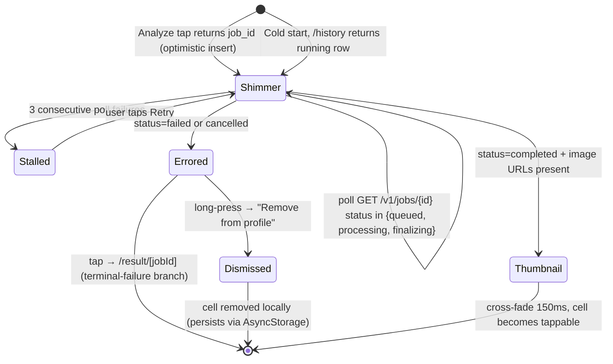

# feat: Glow-Up UX Polish + Advisor Nudges Tuning

## Overview

Seven pre-launch rough edges across the glow-up flow and the advisor surface. Mix of mobile polish (result-screen state machine, waiting copy, grid spacing, tap-through) and one net-new surface (pending-cell lifecycle + server-ack refund toast). Plus a one-line backend model flip for nudges and a replacement for the advisor's chat empty state.

All seven decisions ship in a single PR per user direction (see origin, Open Questions). Decision 5 carries ~80% of the LOC and risk; the rest are light touches.

## Problem Frame

See origin document. Top signals: users land on a "not ready → Go to Profile" screen during normal worker latency; profile grid cells are dead to taps; no surface for in-flight or errored glow-ups; nudges read clinical; Ada's chat opener gives no hint of her scope.

## Requirements Trace

- **R1.** Tapping Analyze lands on waiting view, never on a failure-shaped screen during normal worker latency (origin Decision 1).
- **R2.** Profile grid visually separated from profile bar (origin Decision 2).
- **R3.** Tapping a completed glow-up cell opens the before/after slider (origin Decision 3).
- **R4.** Waiting screen tells the user leaving is safe and the job continues in the background (origin Decision 4).
- **R5.** Processing, failed, and cancelled glow-ups appear on the profile grid (failed/cancelled as muted errored-cell variant, tappable to failure detail, long-press to dismiss); server auto-refunds (already exists) and a toast fires once per device per refunded job via AsyncStorage dedup (origin Decision 5 + addenda; user reversed earlier "no errored cells" scope call during plan review).
- **R6.** Post-analysis nudges use Haiku with existing prompt unchanged; historical reason comment rewritten, not deleted (origin Decision 6).
- **R7.** Advisor Chat empty state replaces the generic `AdvisorEmptyOverlay` with a scoped seed card + 4 starter chips; chip tap sends immediately; card re-renders on paywall-dismissed failed send (origin Decision 7).

## Scope Boundaries

- Non-goals per origin: no new glow-up styles / prompt variants / analysis fields; no redesign of `ProfileHeader`, `GlowUpGrid` cell styling, or the before/after slider itself; `SOUL.md` persona unchanged.
- No refund mechanism changes — server-side refund already exists at `app/generation/worker.py:761-836 _fail_job`.
- No batched multi-job poll endpoint — cap at 3 concurrent pending cells instead.
- No Supabase Realtime subscription — per-cell polling at 2000ms (matching the existing result-screen cadence).
- No account-merge handling for cross-session pending cells (guest → signed-in) — out of scope pre-launch.
- ~~No errored / cancelled cell rendering on the profile grid.~~ **Reversed during plan review.** Errored cells now render as a muted variant with tap-to-failure-detail + long-press-to-dismiss. See U5 + U6.

### Deferred to Separate Tasks

- **Prompt framing for post-analysis nudges** — if Haiku regresses on groundedness, open a separate lightweight brainstorm. Not deferred for this bundle: see origin Decision 6's acceptance which gates the flip on a dev spot-check.

## Context & Research

### Relevant Code and Patterns

- **Result screen:** `mobile/app/result/[jobId].tsx` — existing state machine (waiting / terminal-failure / success) with a 10s 404 grace window (`JOB_CREATION_GRACE_MS`). Uses `useAppQuery` with `refetchInterval` gated on `TERMINAL_STATUSES`.
- **Profile grid:** `mobile/components/profile/GlowUpGrid.tsx` — FlatList with `ListHeaderComponent=ProfileHeader`, accepts an `onItemPress` prop that `mobile/app/(tabs)/profile.tsx` never passes.
- **Grid item shape:** `mobile/components/profile/types.ts` — `GlowUpItem` carries `analysis_id`, `before_image_url`, `after_image_url`, `created_at`. Lacks `job_id` and `status`.
- **History endpoint:** `app/api/users.py:94-101 HistoryEntry` + handler at `:377-432` — filters to rows where `after_key` exists (completed only) and discards job_id during the join.
- **Job polling endpoint:** `mobile/lib/analysis.ts getJobStatus` and `app/api/jobs.py:108-112 get_job` with session-scoped ownership check. `JobStatusResponse.credit_refunded: bool | None` is already populated by `app/api/jobs.py:168-193` (true when `credit_reservation_id` is present and job is in FAILED or CANCELLED).
- **Server-side auto-refund:** `app/generation/worker.py:761-836 _fail_job` already calls `_ledger.refund()` / `_ledger.release()` and sets `usage_event.status='released'` (idempotent). `app/api/jobs.py:249-315 cancel_job` uses the same release path.
- **User-initiated refund endpoint:** `app/api/jobs.py:318+ refund_job` exists for manual refund after a failure; returns `RefundResponse { credit_refunded }`. Reference shape for the new ack endpoint.
- **Nudge scheduler:** `app/advisor/nudge_scheduler.py:166` model site; `:161-162` carries the Haiku → Sonnet rationale comment.
- **Config constants:** `app/config/__init__.py:100 ADVISOR_MODEL_HAIKU = "claude-haiku-4-5-20251001"` confirmed present.
- **Migrations:** sequential numbering under `app/migrations/`. Latest is `0039_jobs_identity_preserved.sql`. **No new migration required** — U2 dropped after scope pivot.
- **Mobile toast:** `mobile/lib/toast.ts showToast({ kind, message })` — existing queue, no need to build one.
- **Advisor empty state:** `mobile/components/advisor/AdvisorEmptyOverlay.tsx` + mount site at `mobile/components/advisor/ChatView.tsx:325-331`.
- **Poll intervals (asymmetric):** `mobile/app/result/[jobId].tsx` hardcodes `2000` ms in three places (`:106,108,113`); `mobile/constants/config.ts ANALYSIS_CONFIG.INTERVAL_MS = 1500` exists but is NOT used by the result screen. U6 uses `2000` to match the result screen; do not introduce a third cadence.
- **Shimmer constant:** `mobile/components/feed/FeedSkeleton.tsx:7 SHIMMER_DURATION_MS = 1200`. Reuse, do not redeclare.
- **JobStatus enum:** `app/generation/models.py:14-20` — `QUEUED, PROCESSING, FINALIZING, COMPLETED, FAILED, CANCELLED`. **No `running` value exists.**

### Institutional Learnings

- `feedback_no_hardcoded_urls.md` — chip strings, toast copy, and card body text must go in `mobile/constants/config.ts` (or a dedicated advisor constants file), not inline.
- `feedback_no_env_fallbacks.md` — no env fallback for the Haiku constant; config already exposes it.
- `feedback_pre_launch_destructive_ok.md` — migration 0040 can add the column without backfill concerns; app is not live.
- `feedback_env_example_sync.md` — this plan introduces no new env vars.
- `feedback_infinite_scroll.md` — pending-cell cap at 3 stacks above the infinite-scroll grid. The cap is visible-slots, not a "load more" button.
- `feedback_disabled_button_ux.md` — waiting-screen "Go to Profile" stays clickable; stalled-cell "Retry" stays clickable.

### External References

Not used. All patterns have strong local examples.

## Key Technical Decisions

- **Pending state lives in client + server.** Optimistic client insert covers the Analyze tap; server `/history` expansion covers cold-start rehydrate. User never sees a lost credit.
- **Toast dedup is device-scoped via AsyncStorage.** `credit_refunded=true AND !seenSet.has(jobId)` is the gate. No backend ack endpoint — the errored cell on the grid is the durable artifact; the toast is a transient heads-up. Dedup survives app kill on the same device; cross-device the toast may fire once per device, which is acceptable because the cell signal is universal.
- **Errored cells render on the grid** as a muted variant with tap-to-failure-detail and long-press-to-dismiss. Reversed from an earlier scope call during plan review.
- **Per-cell polling, capped at 3.** Simpler than batched endpoint; load is bounded by the cap.
- **Result screen stays the single job-detail surface.** Pending cell tap → `/result/[jobId]` waiting view. Completed cell tap → `/result/[jobId]` success view (existing code path). No new detail route.
- **Haiku flip keeps the rationale comment.** Flipping the model twice in a month without preserving the reason trail creates an epistemic hole for the next engineer. Comment is rewritten to historical note.
- **Chat empty-state card replaces `AdvisorEmptyOverlay` at its existing mount site.** Same listArea slot, same `messages.length === 0` gate. No new overlay layer.

## Open Questions

### Resolved During Planning

- ~~**Where does `refund_acknowledged_at` live?**~~ → Moot. U2 dropped in favor of AsyncStorage dedup after the "show errored cells" scope pivot.
- **Does the ack endpoint authenticate via the same `get_user_or_guest` pattern as `cancel_job` / `refund_job`?** → Yes, same pattern. Session-scoped ownership check.
- **How does the pending cell know a job failed if `/history` doesn't return failed rows?** → The per-cell poll hits `GET /v1/jobs/{id}` directly. Once `status` flips to `failed`/`cancelled`, the client removes the cell locally. On cold start, the history endpoint returns only `running/queued/processing/finalizing` + `completed` rows, so failed cells never appear.
- **Stalled cell retry mechanics?** → Client-local retry button re-enables the React Query poll. No server endpoint needed.

### Deferred to Implementation

- Exact value for the hard timeout on `status=completed` with null URLs (origin suggested ~60s; planning picks during impl based on observed worker envelope).
- Precise shimmer animation values (opacity oscillation curve, duration) — tune during visual QA, default to existing skeleton pattern if one exists in the codebase; otherwise `react-native-reanimated` shared-value pulse at 1.2s.
- Whether the stalled-cell Retry button restarts the React Query poll vs. remounts the cell — trivial call, pick during impl.
- Exact dev-only toggles for Decision 1 repro harness — env-gated; pick flag names during impl.

## High-Level Technical Design

> *This illustrates the intended approach and is directional guidance for review, not implementation specification. The implementing agent should treat it as context, not code to reproduce.*

### Pending-cell lifecycle (mobile)



### Refund toast gate (cross-cutting)

```
Client logic (module-level Set backed by AsyncStorage):
  on each GET /v1/jobs/{id} response where credit_refunded === true:
    if !seenSet.has(jobId) && job.user_id === currentUserId && !onAuthScreen:
      seenSet.add(jobId)
      markSeenInStorage(jobId)   // fire-and-forget
      showToast(copy for status)
```

Server flag `credit_refunded` already computed — no server changes. Dedup is device-scoped; the errored cell on the grid carries the durable signal across devices.

### History endpoint change (backend)

Before: `SELECT ... JOIN latest completed job ... WHERE after_key IS NOT NULL`
After: `SELECT ..., j.id AS job_id, j.status, after_key (null when not yet present) WHERE j.status IN ('queued','processing','finalizing','completed')` with server-side `LIMIT` cap on non-terminal rows

Failed and cancelled rows stay excluded.

## Implementation Units

Dependency order (U2 dropped — errored cells chosen over server-ack):

```
U1 (history endpoint) ─────> U5 (grid tap + types + key) ──> U6 (pending + errored cells) ──> U7 (toast + AsyncStorage)
U3 (Haiku flip)       (independent)
U4 (result screen)    (independent — landing before U5 means tap-through exercises the improved waiting view)
U8 (chat empty)       (independent)
```

- [ ] **Unit 1: Expand history endpoint with job_id + status; include non-terminal rows**

**Goal:** Make `GET /v1/users/{username}/history` return `job_id`, `status`, and rows whose latest job is in a non-terminal state (excluding failed/cancelled). Unblocks grid tap-through (U5), pending rehydrate on cold start (U6), and the toast gate (U7).

**Requirements:** R3, R5.

**Dependencies:** None.

**Files:**
- Modify: `app/api/users.py` (`HistoryEntry` model at :94-101, history handler at :293-450 — handler composes the query inline using `upload_repo.list_for_user`, `glowup_analysis_repo`, `job_repo.get_completed_jobs_for_sources`, `image_repo.create_signed_url`; there is no consolidated `user_repo` join method)
- Modify: `app/repositories/job_repo.py` — `get_completed_jobs_for_sources` at :147-176 currently hardcodes `.eq("status", "completed")` and selects a narrow column set. Widen it (or add `get_latest_jobs_for_sources`) to take a status set and return `id, status, source_id, after_image_url, created_at`.
- Modify: `mobile/components/profile/types.ts` (`GlowUpItem`)
- Test: `tests/test_users.py`

**Approach:**
- Add `job_id: str | None` and `status: str` to `HistoryEntry`. `job_id` nullable for any legacy rows without an associated job.
- Widen (or add) the repo method so the query accepts a status set. Canonical set per `app/generation/models.py JobStatus`: `queued, processing, finalizing, completed, failed, cancelled`. **There is no `running` status in the enum** — do not invent one. `failed` and `cancelled` ARE included (user reversed earlier scope call — errored cells are now durable artifacts on the grid).
- Handler: remove the `if not after_key: continue` filter. `after_image_url` stays optional (null for non-completed rows).
- **Authorization boundary (explicit):** keep the transitive user-scoping chain intact — `upload_repo.list_for_user(user_id)` produces `source_ids`; jobs query runs with `IN (source_ids)`. Do not write a direct `jobs WHERE status IN (...)` query without an `AND user_id = :user_id` clause or the upstream source-id filter. This is the same pattern documented at `app/api/users.py:334` (L-1 enumeration prevention).
- **Server-side cap on non-terminal rows:** add a server-side `LIMIT` (e.g. `MAX_PENDING_ROWS_PER_PAGE = 10`) on the non-terminal branch to bound the payload if a worker-failure loop leaves many rows in `processing`. Completed rows keep the existing page size.
- Mirror the new fields in `GlowUpItem` on mobile.

**Patterns to follow:**
- `JobStatus` enum at `app/generation/models.py:14-20` (authoritative).
- 404-on-mismatch pattern at `app/api/users.py:334` (L-1).

**Test scenarios:**
- Happy path: user with one completed glow-up → history returns one entry with `job_id`, `status='completed'`, and both image URLs.
- Happy path: user with one queued + one completed glow-up → history returns two entries in created-desc order, queued entry has `after_image_url=None`, `status='queued'`.
- Edge case: user with only a `finalizing` job → history returns the finalizing row.
- Edge case: user with only a `processing` job → history returns the processing row.
- Edge case: user with a `failed` job → row IS included with `status='failed'`, `after_image_url=null`.
- Edge case: user with a `cancelled` job → row IS included with `status='cancelled'`, `after_image_url=null`.
- Edge case: legacy glow-up row with no associated job → `job_id=null`, `status` derives from the existing legacy column.
- **Cross-user isolation (security):** user A has a queued job; user B's `/history` must not contain user A's row.
- Edge case: user with 15 processing rows → response caps at `MAX_PENDING_ROWS_PER_PAGE` and still respects the pagination cursor.
- Pagination: existing cursor behavior unchanged across completed rows.

**Verification:**
- Pytest suite passes with new scenarios including cross-user isolation.
- Manual: curl the endpoint as a guest with a pending job and confirm the pending row appears.

- [ ] **Unit 2: (DROPPED) — No backend refund changes**

~~Migration + refund ack endpoint.~~ **Dropped after user decision to restore errored cells on the profile grid.** The durable artifact IS the errored cell — the toast becomes a "just happened" heads-up, not the sole error signal. Server-ack dedup is overkill; client-side AsyncStorage dedup is sufficient. Server-side auto-refund at `app/generation/worker.py:761-836 _fail_job` already works and remains untouched.

**Net backend work for Decision 5 reduces to U1's history endpoint expansion.** No migration 0040, no new endpoint, no new config constant, no rate-limit decision — all moved out of scope.

The `credit_refunded` flag on `JobStatusResponse` already exists (`app/api/jobs.py:168-193`) and needs no change. Toast dedup moves to U7's client-side AsyncStorage scope.

- [ ] **Unit 3: Flip nudge model to Haiku; rewrite rationale comment**

**Goal:** Switch post-analysis and generic nudges from Sonnet back to Haiku. Preserve the rationale trail in a historical comment.

**Requirements:** R6.

**Dependencies:** None.

**Files:**
- Modify: `app/advisor/nudge_scheduler.py`
- Test: no change to `tests/test_advisor_nudge_post_analysis_grounded.py` — must still pass

**Approach:**
- Change `settings.ADVISOR_MODEL_SONNET` → `settings.ADVISOR_MODEL_HAIKU` at the adapter call site (around :166).
- Rewrite comment at :161-162 to: `# Haiku → Sonnet switch was reverted 2026-04-17: Sonnet's post-analysis output read as clinical ("Oval face shapes are versatile..."). Re-evaluate if grounded-output complaints rise.`
- No changes to prompts in `app/advisor/nudge_templates.py`.
- Leave entitlement, cooldown, and insight-skip logic untouched.

**Execution note:** Before merging, run the dev-env spot-check per origin Decision 6 acceptance: trigger three `post_analysis` nudges on real analyses from the dev DB and review for tone + groundedness. If any reads as ungrounded (references features not in the insight), **drop U3 from this PR** (revert the one-line model swap + comment edit on the branch) and ship the other six decisions. Open a separate brainstorm for prompt-framing. **Do not hold the whole PR** — U3 is isolable by construction; the rest of the bundle closes real pre-launch signals and should not be coupled to the tone gate.

**Revert recipe (post-merge regression):** if Haiku ships and production complaints arrive, revert is `git revert` of the single commit that touched `nudge_scheduler.py` — keep U3 as its own commit on the feature branch to make this trivial.

**Patterns to follow:**
- Existing adapter wiring at `app/advisor/nudge_scheduler.py:163-170`.

**Test scenarios:**
- Test expectation: existing tests in `tests/test_advisor_nudge_post_analysis_grounded.py` must continue to pass unchanged (they mock the adapter; model ID flip is transparent).

**Verification:**
- `make test` passes unchanged suite.
- Manual dev spot-check per Execution note.

- [ ] **Unit 4: Result screen — waiting view, latency tolerance, dev repro toggles**

**Goal:** Fix the "premature not ready" screen (origin Decision 1) and update the waiting copy (origin Decision 4).

**Requirements:** R1, R4.

**Dependencies:** None for the copy change. For the latency fixes, none strictly — but landing this before U5 means tap-through from the grid into a pending cell will exercise the improved waiting view.

**Files:**
- Modify: `mobile/app/result/[jobId].tsx`
- Modify: `mobile/constants/config.ts` — add constants for the new grace windows (no magic numbers per `feedback_no_hardcoded_urls.md`)
- Test: `mobile/app/result/__tests__/[jobId].test.tsx` if Jest tests exist for this route; otherwise manual QA with repro harness.

**Approach:**
- Rewrite the `isWaiting` branch copy per Decision 4: headline "Your glow-up is being generated."; body "You can leave this screen — we'll drop the result on your profile when it's done."; keep `PageBackground` and "Go to Profile" button.
- **Hourglass animation:** apply a slow `withRepeat(withTiming(rotate, { duration: THEME.animation.slow }))` rotation, or swap to a pulse if rotation reads as spinner-like. The current code renders a static hourglass during a 60–120s wait, which reads as frozen. Gate the animation on `useReducedMotion()` — fall back to static for users who disabled motion.
- 404-after-grace path: convert to waiting render with a second hard timeout. **Must be ≥ 210s** to stay above the server's `GENERATION_TIMEOUT_SECONDS + 30` watchdog (`app/config/__init__.py:158` defines `GENERATION_TIMEOUT_SECONDS = 180`; `worker.py:857` runs the stuck-job sweep at +30). A client timeout below 210s would produce false "not ready" screens while the worker is legitimately still running. Recommended: `RESULT_SCREEN_HARD_TIMEOUT_MS = 240_000` (4 min buffer above the server-side ceiling).
- `status=completed` with null URLs: treat as waiting for up to `RESULT_SCREEN_IMAGE_URL_TIMEOUT_MS = 60_000` elapsed since first seen.
- **Repro harness is server-side, not client-side.** A client-side mock that fakes 15s latency around `getJobStatus` does not exercise the real race (worker's row-insert is slow relative to the client's grace window). Add a pytest fixture + endpoint-level toggles on the worker (`_generate_glowup_job` gated on `DEV_GLOWUP_INJECT_ROW_DELAY_SECONDS` and `DEV_GLOWUP_EMIT_NULL_URLS_ON_COMPLETE`) so integration tests can deterministically reproduce both branches. Client-side env flags stay as secondary QA aid but must not be the primary acceptance gate.

**Patterns to follow:**
- Existing `refetchInterval` gating in `useAppQuery` (`result/[jobId].tsx:95-115`).
- Theme constants + PageBackground usage in the current `isWaiting` branch.

**Test scenarios:**
- Happy path: 404 within grace window → waiting view renders.
- Happy path: 404 after grace window but before hard timeout → waiting view still renders (not error branch).
- Edge case: `status=completed` with null image URLs → waiting view for up to 60s, then terminal-failure branch.
- Edge case: hard timeout fires → error branch with "Go to Profile" CTA.
- Happy path: pressing "Go to Profile" from waiting view does not call `cancelJob` (verify: no network call to DELETE /v1/jobs/{id} on navigation).

**Verification:**
- Manual QA via dev toggles: inject latency and null-URL cases and confirm the user stays on the waiting view.
- Copy renders exactly as specified.

- [ ] **Unit 5: Profile grid spacing + cell tap-through + GlowUpItem types**

**Goal:** Visual breathing room between ProfileHeader and grid; tap completed cells to open the before/after slider.

**Requirements:** R2, R3.

**Dependencies:** U1 (needs `job_id` on `GlowUpItem`).

**Files:**
- Modify: `mobile/components/profile/GlowUpGrid.tsx` (`gridContent.paddingTop`; pass `job_id` through cell onPress)
- Modify: `mobile/app/(tabs)/profile.tsx` (pass `onItemPress` handler)
- Modify: `mobile/components/profile/types.ts` (already covered in U1; re-listed for traceability)
- Test: `mobile/app/(tabs)/__tests__/profile.test.tsx`

**Approach:**
- Bump `gridContent.paddingTop` from `THEME.spacing.sm` (8px) to `THEME.spacing.lg` (16px) as the first attempt. `xl` (20px) was the original target but `lg` matches the paddingHorizontal already used on the same grid's container, creating visual parity. If visual QA shows the gap reads as too tight, escalate to `xl`. Cover both populated and empty-state renders — empty-state centering relies on `flexGrow:1` math; verify the EmptyState title position is still visually centered in the region below ProfileHeader.
- `profile.tsx`: implement `handleItemPress(item: GlowUpItem)` that navigates to `/result/${item.job_id}` when `job_id` is truthy. The result screen handles all branches — waiting (pending), success (completed), terminal-failure (failed / cancelled). For any row with `job_id=null` (legacy), no-op the tap.
- `profile.tsx`: also implement `handleItemLongPress(item)` that, when `item.status` is `failed` or `cancelled`, opens an iOS/Android ActionSheet with "Remove from profile" (and Cancel). Completed and pending cells ignore long-press. Confirmed selection calls `useProfile.dismissErroredItem(job_id)` which (a) removes from local `glowUps` state and (b) writes to AsyncStorage `@nxme:dismissed_errored_jobs`. On next `/history` refetch, the hook filters out dismissed job_ids.
- **FlatList keyExtractor change (load-bearing for U6):** change `GlowUpGrid`'s `keyExtractor` from `item.analysis_id` to `item.job_id ?? item.analysis_id`. This makes U6's optimistic-insert dedup work correctly — the optimistic row and the server's `/history` refetch row share the same `job_id`, so React treats them as the same item and reconciles rather than duplicating. Legacy rows without a `job_id` fall back to `analysis_id` (unchanged behavior).
- Pass `handleItemPress` and `handleItemLongPress` to `GlowUpGrid`. `GlowUpGrid` already has `onItemPress`; add `onItemLongPress?: (item) => void` prop and wire the `Pressable`'s `onLongPress` in `GlowUpCell`.

**Patterns to follow:**
- `router.push('/result/${id}')` used from `mobile/app/upload.tsx:235`.
- Existing `onItemPress` signature in `GlowUpGrid.tsx`.

**Test scenarios:**
- Happy path: tap completed cell → `router.push` called with `/result/{job_id}` (slider view).
- Happy path: tap pending cell → `router.push` called with `/result/{job_id}` (waiting view handles the state).
- Happy path: tap errored (failed/cancelled) cell → `router.push` called with `/result/{job_id}` (terminal-failure branch).
- Happy path: long-press errored cell → action sheet opens; confirm remove → cell gone from grid, job_id added to dismissed-set in AsyncStorage.
- Edge case: long-press completed or pending cell → action sheet does NOT open.
- Edge case: tap cell with `job_id=null` → no navigation.
- Edge case: dismissed errored cell stays gone after pull-to-refresh + app relaunch.
- Visual: RN-testing-library snapshot or manual screenshot shows clear air gap between `@username` row and first grid row.
- Visual: empty-state copy still centers in the region below ProfileHeader on a fresh account.

**Verification:**
- Jest test for tap behavior passes.
- Manual QA screenshot on iPhone 15 Pro Simulator shows the spacing and tap-through flow.

- [ ] **Unit 6: Pending + errored cells, per-cell polling, cap-at-3**

**Goal:** Optimistic pending cell on Analyze tap, rehydrated on cold start, with shimmer state that cross-fades to the real thumbnail on completion or transitions to an errored-cell variant on failure/cancel.

**Requirements:** R5.

**Dependencies:** U1 (history endpoint), U4 (result screen waiting view as tap target), U5 (grid tap wiring).

**Files:**
- Modify: `mobile/components/profile/GlowUpGrid.tsx` (or new `mobile/components/profile/PendingGlowUpCell.tsx`)
- Modify: `mobile/components/profile/useProfile.ts` (optimistic insert on Analyze completion; state management for pending rows)
- Modify: `mobile/app/upload.tsx` (after `generateGlowup` returns, signal the profile cache to insert a pending row)
- Modify: `mobile/app/result/[jobId].tsx` (update `refetchInterval` to honor `Retry-After` on 429 and do exponential backoff on 5xx — same logic the new pending-cell poller uses; avoids the existing bug where 429 resumes at 2s ignoring the server hint)
- Modify: `mobile/lib/query-client.ts` (respect `query.meta?.silentRateLimit` in `QueryCache.onError` to skip the per-429 toast for polling queries)
- Modify: `mobile/constants/config.ts` (add `PROFILE_PENDING_CELL_MAX_VISIBLE = 3`, `POLL_RATE_LIMIT_MAX_MS = 30_000`, `POLL_BACKOFF_MAX_MS = 16_000`, `POLL_RATE_LIMIT_DEFAULT_S = 10`)
- Test: `mobile/components/profile/__tests__/PendingGlowUpCell.test.tsx` (new or within existing GlowUpGrid test file)
- Test: `mobile/lib/__tests__/query-client.test.ts` (extend to cover `meta.silentRateLimit`)

**Approach:**
- Pending cell = `GlowUpCell` variant rendered when `item.status !== 'completed'`. Renders a shimmer view in place of the `after_image_url` Image. Keeps the `before_image_url` overlay if present.
- **Shimmer cadence:** reuse the existing `SHIMMER_DURATION_MS = 1200` pattern from `mobile/components/feed/FeedSkeleton.tsx:7` (full cycle 2400ms). Do NOT invent a new cadence — shimmer consistency across skeletons is a polish signal. Gate animation on `useReducedMotion()` — fall back to a static muted block for users who disabled motion.
- **Polling:** each pending cell owns a `useAppQuery` poll of `GET /v1/jobs/{job_id}` at `2000` ms — match the existing result-screen cadence at `mobile/app/result/[jobId].tsx:106,108,113` (which hardcodes 2000, not `ANALYSIS_CONFIG.INTERVAL_MS`). Stop polling when `status` in TERMINAL set (`completed`, `failed`, `cancelled`). **Errored cells do NOT poll** — they're terminal. Cap at 3 concurrent pending polls (errored cells don't count); extras queued-not-polled.
- **Shared queryKey for dedup:** both the pending-cell poller and the result-screen poller use `queryKey: ["job", jobId]`. React Query collapses observers with the same key into **one network request** — if the user is on the result screen for the same job a pending cell is polling, only one `GET` fires per 2s. No extra server load.

- **429 Rate Limit handling (defensive):** `GET /v1/jobs/{id}` is not currently rate-limited server-side, but the client must behave correctly if that changes (or if a shared proxy throttles). The infrastructure already exists — wire it in:
  - **`refetchInterval` honors `Retry-After`.** Currently the result screen's `refetchInterval` (lines 95–114) returns `shouldRetry(appError) ? 2000 : false` — which treats 429 identically to 500 and resumes polling at 2s, ignoring the server's `Retry-After` hint. Fix in both the result screen and the new pending-cell poller:

    ```
    refetchInterval: (query) => {
      const err = query.state.error;
      if (err) {
        const appError = parseApiError(err);
        if (appError.kind === 'rateLimit') {
          // Respect server hint; cap at 30s so we don't stall forever
          return Math.min((appError.retryAfter ?? 10) * 1000, 30_000);
        }
        if (appError.kind === 'server') {
          // Exponential backoff via failureCount: 2s, 4s, 8s (cap 16s)
          const attempt = Math.min(query.state.fetchFailureCount, 3);
          return Math.min(2000 * (2 ** attempt), 16_000);
        }
        // notFound grace-window branch stays as-is (result screen only)
        return shouldRetry(appError) ? 2000 : false;
      }
      // ... existing success path
    }
    ```

  - **Suppress the per-poll rate-limit toast.** The global `QueryCache.onError` in `mobile/lib/query-client.ts:45-47` fires `showToast({ kind: 'warning', message: appError.message })` on every 429 — if a pending cell gets 429'd three times while backing off, the user gets three toasts about rate-limiting. Mark job-polling queries with `meta: { silentRateLimit: true }` and update the global `onError` to skip the toast when that flag is set:

    ```
    // In use-app-query wrapper or directly on the poll:
    useAppQuery({ queryKey: ['job', jobId], meta: { silentRateLimit: true }, ... })

    // In query-client.ts onError:
    if (appError.kind === 'rateLimit' && !query.meta?.silentRateLimit) {
      showToast({ kind: 'warning', message: appError.message });
    }
    ```

  - **Persistent 429s → stalled cell.** The existing 3-consecutive-poll-errors → stalled path (see below) counts 429s the same as 5xx. A user who hits sustained rate-limiting sees the cell's `Retry` button instead of an infinite back-off spiral.
  - **React Query's `retry` + `retryDelay` in `query-client.ts:20-25` already handle transient 429s** via `computeDelay`, which honors `retryAfter * 1000`. That's the attempt-level retry. The `refetchInterval` change above is the poll-level cadence — both layers now respect the server hint.
  - **Max-duration cap:** if a single pending cell spends more than `RESULT_SCREEN_HARD_TIMEOUT_MS` (~4min per U4) in combined retry + backoff without reaching a terminal status, flip to the stalled variant regardless of error kind. Prevents a cell from looping on `retryAfter: 3600` responses for an hour.

- **Server-side note (no change in this bundle):** if `GET /v1/jobs/{id}` is ever rate-limited, the handler must emit a `Retry-After` header (seconds) per the existing pattern in `app/api/errors.py rate_limit_handler`. Out of scope for this plan — flagged so a future rate-limit PR doesn't ship without Retry-After.
- On `status='completed'` with both image URLs: update the grid's item in place (cross-fade 150ms from shimmer to thumbnail).
- On `status='failed'` or `'cancelled'`: **transition in place to the errored-cell variant** (see below). No fade-out, no removal. Cell remains tappable; tap opens `/result/[jobId]` terminal-failure branch where the user sees what happened and can try again.

**Errored-cell variant** (new component / new style branch inside `GlowUpCell`):
- Background: `before_image_url` with a desaturation overlay (use `tint` or a semi-transparent dark fill at 60% opacity).
- Corner icon: `alert-circle-outline` for `failed`, `close-circle-outline` for `cancelled`. Icon color: `THEME.colors.destructive` for failed, `THEME.colors.textSecondary` for cancelled. Size ~18px.
- No shimmer animation.
- Accessibility label: `"Failed glow-up from {date} — tap to view details"` or `"Cancelled glow-up from {date} — tap to view details"`.
- Tap handler identical to completed cells: navigate to `/result/[jobId]`.

**Long-press to dismiss errored cells:** long-press an errored cell → action sheet with one option `"Remove from profile"` (plus Cancel). Tap → remove the cell locally from `glowUps` state. No server call (job row stays in DB for audit; `/history` won't re-include it because the client keeps a session-local dismiss Set keyed on `jobId` and filters incoming rehydrates). Dismiss Set persists via AsyncStorage (`@nxme:dismissed_errored_jobs`) so dismissed cells stay gone across app launches.
- **Optimistic insert on useState-backed state (not React Query):** `mobile/components/profile/useProfile.ts` holds `glowUps` in plain `useState`, not React Query. Plan does NOT migrate this to React Query (scope creep). Instead: expose a `prependPendingItem(item)` / `reconcileOnRefetch(serverItems)` pair on the hook. Optimistic insert pushes `{ analysis_id: temp_id, job_id, status: 'queued', created_at: now, before_image_url, after_image_url: null }` to the top of `glowUps`. On next refetch, dedupe by `job_id`: if server returns a row with the same `job_id`, replace the optimistic entry in place; drop any optimistic rows whose `job_id` is missing from the server response after a grace window (e.g. 5s).
- **Cap:** max 3 pending cells in `glowUps` at any time. Additional Analyze taps (if credits allow) queue the generate-job request; the optimistic insert waits until a slot frees. Implementation: check `pending_count < 3` before pushing to state.
- **Stalled path:** after 3 consecutive poll errors, cell enters `stalled` variant — shimmer stops, shows a `<Button variant="outline" size="sm" title="Retry" />`. Retry re-arms the poll. **Terminal escape:** if 3 more consecutive errors after Retry (6 total in this session), cell auto-removes itself with the 150ms fade; user is left with a toast `"We couldn't reach the server. Pull down to refresh."` so they know why a cell they saw earlier is gone.
- `handleSend` in ChatView currently takes no args (`ChatView.tsx:182-236`) — out of scope for U6; mentioned only to note that the analyze-then-insert flow uses `generateGlowup()` directly in `upload.tsx`, not via a shared send helper.

**Patterns to follow:**
- `useAppQuery` polling pattern from `mobile/app/result/[jobId].tsx:91-115`.
- Animation primitives: `react-native-reanimated` `useSharedValue` + `withSpring` / `withTiming` (already used in `GlowUpCell`).

**Test scenarios:**
- Happy path: render with 1 pending item → cell shows shimmer.
- Happy path: poll returns `status='completed'` with URLs → cell cross-fades to thumbnail.
- Happy path: poll returns `status='failed'` → cell transitions in place to errored variant (failed icon, desaturated). Polling stops.
- Happy path: poll returns `status='cancelled'` → cell transitions in place to errored variant (cancelled icon). Polling stops.
- Happy path: tap errored cell → navigate to `/result/[jobId]` terminal-failure branch.
- Happy path: long-press errored cell → action sheet opens with "Remove from profile" option; tap removes cell locally; restart app → cell stays gone (AsyncStorage-backed dismiss Set).
- Edge case: 5 pending items in state → only 3 render as pending; 4th and 5th wait until one resolves (to completed OR errored — errored cells free the polling slot).
- Edge case: 3 consecutive poll 500s → cell flips to stalled variant with Retry button. 3 more consecutive errors after Retry → cell auto-removes (6-error ceiling per session).
- Edge case: poll returns 429 with `Retry-After: 5` header → next poll fires at 5s (not 2s). No warning toast appears (meta.silentRateLimit).
- Edge case: poll returns 429 with no `Retry-After` → falls back to 10s default, capped at 30s.
- Edge case: 3 consecutive 429s → cell flips to stalled variant (same path as 5xx).
- Edge case: poll returns 500 → exponential backoff (2s → 4s → 8s, capped 16s). Resumes 2s cadence on next successful poll.
- Edge case: pending cell running with result screen also open for the same jobId → only ONE network request per 2s (React Query dedup via shared `['job', jobId]` key).
- Edge case: poll stalled for >4min combined (retry + backoff + 429 sleep) → force-flip to stalled regardless of error kind.
- Edge case: Retry tap on stalled cell → poll resumes; on next successful poll, cell returns to shimmer state.
- Integration: Analyze tap in `upload.tsx` → optimistic pending cell appears on profile tab within 200ms of `generateGlowup` resolution.
- Integration: cold start with active processing job → `/history` returns the processing row, grid renders the shimmer cell, poll takes over.
- Integration: cold start with a failed job from a prior session → `/history` returns the failed row, grid renders the errored-cell variant immediately (no polling needed).

**Verification:**
- Jest tests pass.
- Manual QA: on a simulator, tap Analyze, navigate to profile tab, confirm shimmer cell renders and resolves to thumbnail.
- Manual QA: force-quit the app during a running job; reopen; confirm the shimmer cell rehydrates.

- [ ] **Unit 7: Refund toast + AsyncStorage dedup**

**Goal:** User sees a one-time toast when a credit is refunded, dedup-scoped to the device via AsyncStorage so the toast doesn't re-fire on every app launch.

**Requirements:** R5.

**Dependencies:** U6 (pending-cell poller is the primary observer; result-screen poller is the secondary observer). **No longer depends on U2** (U2 dropped).

**Files:**
- Create: `mobile/lib/hooks/use-refund-toast.ts`
- Create: `mobile/lib/refund-toast-store.ts` (AsyncStorage wrapper for the dedup Set)
- Modify: `mobile/components/profile/useProfile.ts` (wire the hook into the job polling observer)
- Modify: `mobile/app/result/[jobId].tsx` (wire the hook into the result-screen polling observer)
- Modify: `mobile/constants/config.ts` (toast copy strings: `REFUND_TOAST_FAILED`, `REFUND_TOAST_CANCELLED`; storage key `REFUND_TOAST_SEEN_KEY = "@nxme:refund_toasts_seen"`)
- Test: `mobile/lib/hooks/__tests__/use-refund-toast.test.ts`

**Approach:**
- `useRefundToast` observes job-status responses from both pollers (pending-cell + result-screen). Gate: `credit_refunded === true AND !seenSet.has(jobId)`. No `refund_acknowledged` field on the server — U2 was dropped.
- **AsyncStorage-backed Set:** `refund-toast-store.ts` exposes `hasSeen(jobId): Promise<boolean>` and `markSeen(jobId): Promise<void>`. Implementation: a single key storing a JSON array (cap the array at 200 entries, drop oldest on overflow — failures are rare so 200 entries covers months of user history). Loaded once on hook mount; in-memory mirror for sync reads.
- **Write-before-show:** sequence inside the observer is `if (!seen.has(jobId)) { seen.add(jobId); markSeen(jobId); showToast(copy); }`. Order matters — write to the in-memory Set synchronously, kick the AsyncStorage write (fire-and-forget), show the toast. A second poll in the same session cannot double-fire because the Set is updated immediately.
- **Module-level** (not hook-local `useRef`) — the pending-cell poller and the result-screen poller observe the same singleton Set. Re-entry across different observers for the same job is safe.
- **Toast kind: `'success'`** — the user is getting credit back. `'success'` gives the right haptic + title. `'info'` (`mobile/lib/toast.ts:25`) routes to a warning haptic and reads off-key.
- **Copy (unified noun — "credit"):**
  - `status='failed'` → `REFUND_TOAST_FAILED = "That one's on us — your credit's back. Try a new photo?"`
  - `status='cancelled'` → `REFUND_TOAST_CANCELLED = "Cancelled — your credit's back."` (two-l spelling matches `status: 'cancelled'`).
- **User-id check (shared-device privacy):** before calling `showToast`, compare `job.user_id` against the current session's `user_id` from `useAuth()`. If they differ, suppress toast (but still markSeen so it doesn't fire later). Fixing a refund notification that discloses a previous user's failure on a shared device.
- **Auth-screen suppression:** check `usePathname()` — if path starts with `/(auth)`, suppress toast (still markSeen). User is typing credentials; a banner overlapping input is disruptive.
- `mobile/lib/toast.ts` already handles the queue via burnt.

**Why this is simpler than server-ack:**
- The errored cell is now the durable signal. If the toast re-fires cross-device, the user sees it and the cell matches — no confusion.
- AsyncStorage is device-scoped; cross-device re-fire is possible but bounded to "once per device per job" — acceptable trade because refund events are rare AND the cell itself carries the persistent evidence.
- Zero backend scope. U2's migration + endpoint + rate-limit decision all dropped.

**Patterns to follow:**
- `use-purchase-flow.ts` — existing React hook shape that wraps a server call.
- `showToast` call sites in `mobile/app/upload.tsx`.

**Test scenarios:**
- Happy path: job flips to `status='failed'`, `credit_refunded=true`, jobId NOT in seen Set → toast fires once with failed copy ('success' kind); jobId added to Set + AsyncStorage.
- Happy path: job flips to `status='cancelled'`, `credit_refunded=true` → toast fires once with cancelled copy.
- Edge case: jobId already in seen Set (same session) → toast does NOT fire.
- Edge case: jobId in AsyncStorage from a prior session → toast does NOT fire (in-memory Set hydrated from storage on mount).
- Edge case: `credit_refunded=null` → toast does NOT fire; no Set write.
- Edge case: poller sees the same job twice in quick succession → toast fires once (Set updated synchronously before AsyncStorage write completes).
- Edge case: pending-cell poller and result-screen poller both observe the same failed job in the same session → toast fires once (both observers share the module-level Set).
- Edge case: `job.user_id !== current session user_id` → toast suppressed; Set still updated (prevents delayed fire after session rotation).
- Edge case: user is on `/(auth)/login` screen when flip happens → toast suppressed (auth-screen carve-out); Set still updated.
- Edge case: AsyncStorage Set reaches 200 entries → oldest entry dropped on next `markSeen`.
- Error path: AsyncStorage write fails (rare) → in-memory Set still has the jobId so no double-fire in session. On next launch, the persisted Set won't have it → toast may re-fire once per launch until AsyncStorage succeeds. Accept.
- Integration: result screen polling on a failed job → toast fires exactly once as `credit_refunded=true` lands.

**Verification:**
- Jest tests pass.
- Manual QA: use dev toggle from U4 to force a failure; confirm toast appears once; force-quit app; relaunch and confirm toast does not re-fire.

- [ ] **Unit 8: Advisor Chat empty-state card replaces `AdvisorEmptyOverlay`**

**Goal:** Scoped seed state for the Chat tab — title, body, 4 starter chips. Replaces the generic "Start a conversation" overlay.

**Requirements:** R7.

**Dependencies:** None.

**Files:**
- Create: `mobile/components/advisor/AdvisorChatEmpty.tsx`
- Modify: `mobile/components/advisor/ChatView.tsx` (swap `AdvisorEmptyOverlay` mount at :325-331 for the new component)
- Modify: `mobile/constants/config.ts` (add `ADVISOR_CHAT_STARTER_CHIPS: readonly string[]`, title + body strings)
- Test: `mobile/components/advisor/__tests__/AdvisorChatEmpty.test.tsx`

**Approach:**
- New component renders inside the same `listArea` slot. **Layout: normal flow, top-aligned** with vertical padding — NOT `StyleSheet.absoluteFill` like `AdvisorEmptyOverlay`. Rationale: the chips are interactive and must not z-conflict with the composer below. Normal flow keeps the composer un-obscured and avoids the pointerEvents-box-none dance. Uses the existing `EmptyState` primitive for title + body with `center={false}`; adds a horizontal scroll strip of pill-shaped chips below the body.
- **Chip component:** `<Button variant="outline" size="sm" />`. Inherits `accessibilityRole="button"` and `accessibilityLabel` defaulting to the title text (per `mobile/components/ui/Button.tsx:214`) — no custom Pressable needed, no a11y retrofit.
- **Chip tap sends immediately.** But `ChatView.tsx:182-236`'s `handleSend` takes **no arguments** (reads `inputText` state). U8 requires a signature change: refactor `handleSend` to accept an optional `text?: string` parameter, defaulting to `inputText.trim()` when absent. Chip tap calls `handleSend(chipText)` directly — no `setInputText` race.
- **Offline-safe:** if the chip-triggered send fails due to network error, restore the chip text to the composer (`setInputText(chipText)`) so the user can see it and retry. 402 paywall is the only already-handled failure path; this adds the network-error path.
- Paywall flow: if the send hits 402 and the modal is dismissed with `messages.length === 0` still true, the empty-state card re-renders naturally because mount is a pure function of `messages.length`.
- Inline code comment links the hardcoded scope to `app/advisor/SOUL.md` — "If SOUL.md persona lanes change, update the body copy and chips here."
- Body copy: "I can help with hair, beard, fit, skincare, or grooming — *or ask me anything else you're thinking about.*" (italic trailing clause prevents the chip list reading as exhaustive).
- Chips (stored in `mobile/constants/config.ts` as `ADVISOR_CHAT_STARTER_CHIPS: readonly string[]`):
  - "What hairstyle would suit me?"
  - "Should I try a beard?"
  - "How do I fix the fit of my clothes?"
  - "What should I focus on next?"
- Do not touch `AdvisorEmptyOverlay.tsx` — other advisor tabs (Nudges, Memories) still use it.

**Patterns to follow:**
- `AdvisorEmptyOverlay` for the absoluteFill + pointer-events-none container.
- `EmptyState` primitive for title + description.
- Existing pill-button styles in the app (check `mobile/constants/theme.ts` for pill radius + padding tokens).

**Test scenarios:**
- Happy path: Chat tab with `messages.length === 0` → new card renders; `AdvisorEmptyOverlay` does not render for this tab.
- Happy path: tap a chip → send handler invoked with the chip text.
- Edge case: `messages.length === 1` → card does not render.
- Edge case: paywall 402 on chip send + dismiss → `messages.length` still 0 → card re-renders.
- Integration: opening Chat with existing history skips the card entirely (same `length === 0` gate).
- Visual: composer stays mounted beneath the card; keyboard-open does not cause layout jump.

**Verification:**
- Jest tests pass.
- Manual QA: fresh guest → advisor tab → confirm new card; tap each chip and confirm immediate send.
- Manual QA: Nudges and Memories tabs still use the original overlay (regression check).

## System-Wide Impact

- **Interaction graph:** pending-cell poller + result-screen poller + refund-toast hook form a new observer chain around `GET /v1/jobs/{id}`. A single job-status response may cascade into (a) cell state update (including pending→errored in-place transition), (b) toast fire. Both keyed off the same shared module-level Set. Decoupled by design: the toast hook takes the response as input, does not refetch.
- **Error propagation:** poll failures must not bubble into error boundaries — stalled-cell variant is the surface. 429s honor `Retry-After` and don't spam toasts (via `meta.silentRateLimit`); 5xx's exponential-backoff. AsyncStorage write failures are log-and-swallow (in-memory Set still dedups the session).
- **Request dedup:** pending-cell poller and result-screen poller share `queryKey: ['job', jobId]`. React Query collapses observers into one fetch, so watching the same job from both surfaces costs one network request per 2s, not two.
- **State lifecycle risks:** optimistic pending cell conflicts with the first `/history` refetch after Analyze. Match by `job_id` on refetch to deduplicate (same key → server row wins). `FlatList.keyExtractor` now prefers `job_id` to support this.
- **API surface parity:** NO new endpoints. Mobile `JobResult` type gets `job_id` + `status` via U1. Web surface (`card-web/`) is unaffected.
- **Integration coverage:** Analyze → pending cell → completion → tap → result screen success. Analyze → pending cell → worker failure → errored-cell variant renders + toast fires once. Long-press errored cell → dismiss. These are the E2E paths that mocks alone won't prove.
- **Unchanged invariants:** SOUL.md persona, result-screen success branch, before/after slider component, nudge prompts, entitlement gate shape, existing refund endpoint (`POST /v1/jobs/{id}/refund`), `JobStatusResponse` shape (no new fields).

## Risks & Dependencies

| Risk | Mitigation |
|------|------------|
| Haiku regresses to ungrounded output on the existing prompt | Pre-merge dev spot-check per U3 Execution note; historical comment preserved so revert is contextualized; **U3 lands as its own commit on the feature branch** so post-merge regression reverts via single `git revert` without touching U1-U8 |
| Optimistic pending cell conflicts with first `/history` refetch | Match by `job_id`; server row replaces optimistic row; covered in U6 integration tests |
| Pending-cell polling load per user | Cap at 3 visible cells; extras queued-not-polled; 2s interval matches existing result-screen polling; shared `['job', jobId]` queryKey dedups result-screen + pending-cell polls into one request; revisit only if telemetry shows problems |
| Sustained 429 on `GET /v1/jobs/{id}` | Poller honors `Retry-After` header, caps at 30s; falls through to stalled-cell variant after 3 rate-limit errors; `meta.silentRateLimit` suppresses per-poll toast spam. Server must emit `Retry-After` if it ever rate-limits this endpoint (flagged for future PR) |
| ~~Ack endpoint race~~ | Removed — U2 dropped. AsyncStorage dedup is per-device and does not have a race. |
| Stalled cell leaves user with no way forward | Retry button stays visible-and-clickable (per `feedback_disabled_button_ux.md`); user can also pull-to-refresh the whole grid |
| Grid spacing bump breaks empty-state centering math | U5 acceptance includes empty-state screenshot QA on fresh account; worst case: pair the `paddingTop` bump with a small `flexGrow` offset in `gridContent` |
| Decision 1 root cause remains unverified until repro harness lands | U4 builds the harness first; both branches fixed before merging; hard timeout acts as backstop regardless of which branch actually fires |
| History endpoint change is a public API shape change (mobile client + any future consumer) | Add new fields as nullable / non-breaking; pre-launch so no existing client bindings to worry about |

## Documentation / Operational Notes

- Update `mobile/.env.example` only if U4's dev toggles introduce env vars (likely `DEV_GLOWUP_INJECT_LATENCY`, `DEV_GLOWUP_INJECT_NULL_URLS`). Follow `feedback_env_example_sync.md` — sync `mobile/.env.example`.
- No monitoring changes required — refund events are already logged in `worker.py _fail_job`. Ack endpoint should log `job %s refund acknowledged by user %s` at INFO.
- No rollout gating — pre-launch, single PR lands on `dev` with no gradual rollout.

## Sources & References

- **Origin document:** [docs/brainstorms/2026-04-17-glowup-ux-polish-and-advisor-nudges-requirements.md](../brainstorms/2026-04-17-glowup-ux-polish-and-advisor-nudges-requirements.md)
- Related code: `mobile/app/result/[jobId].tsx`, `mobile/components/profile/GlowUpGrid.tsx`, `mobile/components/advisor/ChatView.tsx`, `app/api/users.py`, `app/api/jobs.py`, `app/advisor/nudge_scheduler.py`, `app/generation/worker.py`
- Related PRs: #119 (Analyze silent-failure fix), #117 (advisor signing + nudge cooldown) — adjacent pre-launch advisor work
